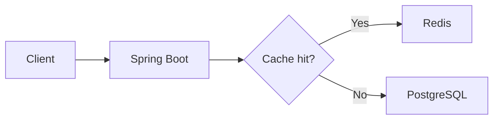

# 블로그 글 작성 가이드

이 블로그는 GitHub Pages와 Jekyll을 사용합니다. 새 글은 `_posts` 폴더에 Markdown 파일로 추가하면 자동으로 목록, 카테고리, 게시글 상세 페이지가 생성됩니다.

## 1. 파일 만들기

파일은 `_posts/YYYY-MM-DD-slug.md` 형식으로 만듭니다.

```text
_posts/2026-07-11-spring-transaction-notes.md
```

- 날짜는 게시일입니다.
- `slug`는 영문 소문자와 하이픈 사용을 권장합니다.
- 미래 날짜의 글은 GitHub Pages에서 바로 보이지 않을 수 있습니다.
- 파일 확장자는 `.md`를 사용합니다.

## 2. 기본 양식

다음 내용을 복사한 후 수정하면 됩니다.

```markdown
---
title: "Spring 트랜잭션에서 확인한 전파 옵션"
date: 2026-07-11 09:00:00 +0900
categories: ["Backend/Spring/Data"]
tags: [Spring, Transaction, JPA]
summary: "트랜잭션 전파 옵션이 실제 서비스 로직에 미치는 영향을 정리했습니다."
excerpt: "REQUIRED와 REQUIRES_NEW를 비교하며 트랜잭션 경계를 설계한 과정을 기록합니다."
---

## 문제 상황

어떤 문제가 있었는지 설명합니다.

### 확인한 내용

- 확인 항목 1
- 확인 항목 2

## 적용 방법

선택한 방법과 선택한 이유를 설명합니다.

## 결과와 회고

적용 결과, 한계, 다시 개선할 내용을 작성합니다.
```

Front Matter를 감싸는 `---`는 반드시 유지해야 합니다.

## 3. Front Matter 항목

| 항목 | 용도 | 예시 |
| --- | --- | --- |
| `title` | 게시글 제목과 브라우저 탭 이름 | `"Redis 캐시 적용 기준"` |
| `date` | 게시 순서와 화면에 표시되는 날짜 | `2026-07-11 09:00:00 +0900` |
| `categories` | 사이드바 카테고리 분류 | `["Backend/Spring/MVC"]` |
| `tags` | 게시글 카드와 본문의 주제 태그 | `[Redis, Cache, Spring]` |
| `summary` | 게시글 상세 제목 아래의 짧은 설명 | 한 문장 권장 |
| `excerpt` | 블로그 목록 카드에 표시되는 요약 | 한두 문장 권장 |

현재 사용하는 카테고리는 다음과 같습니다.

- `Backend/Spring/Common`: Spring Framework 공통 개념
- `Backend/Spring/MVC`: Spring MVC 요청 처리와 웹 기능
- `Backend/Spring/Data`: Spring Data JPA와 Spring Data Redis
- `Learning`

카테고리 필터는 첫 번째 카테고리를 기준으로 동작합니다. 계층은 `/`로 구분하고 글마다 가장 구체적인 카테고리 하나만 지정하는 것을 권장합니다.

새로운 경로는 별도의 HTML 수정 없이 자동으로 폴더 트리에 추가됩니다.

```yaml
categories: ["Backend/FastAPI"]
```

위처럼 작성하면 사이드바에 `Backend → FastAPI`가 자동 생성됩니다. `Backend/Spring/Security`, `Infrastructure/Docker`, `Database/PostgreSQL/Index`처럼 단계가 더 깊은 경로도 동일하게 생성됩니다.

사이드바에서는 카테고리만 다음과 같은 폴더 구조로 표시됩니다.

```text
Backend
└─ Spring
   ├─ Common
   ├─ MVC
   └─ Data
```

- `Backend`, `Spring`, `Common`, `MVC`, `Data`, `Learning`은 디렉터리로 표시됩니다.
- 사이드바에는 개별 게시글 파일을 표시하지 않습니다.
- 디렉터리를 선택하면 해당 Front Matter의 `categories` 값과 일치하는 게시글만 본문 목록에 표시됩니다.
- 새로운 카테고리를 추가할 때는 Front Matter의 `categories` 경로만 작성하면 됩니다.

## 4. 제목과 Article 목차

게시글의 `title`이 화면의 `#` 제목 역할을 하므로 본문에서는 `##`부터 시작합니다.

```markdown
## 주요 목차

본문 내용

### 주요 목차의 하위 항목

세부 내용
```

- `##`: Article 사이드바의 주요 목차
- `###`: 해당 주요 목차를 펼쳤을 때 나타나는 하위 목차
- `####` 이하: 본문용 세부 제목이며 Article 사이드바에는 표시되지 않음
- 제목은 같은 글 안에서 중복하지 않는 것이 좋습니다.

Article 항목을 눌렀을 때 해당 제목으로 이동하므로 제목은 내용을 명확하게 설명하도록 작성합니다.

## 5. 일반 Markdown

```markdown
**굵은 글씨**

`인라인 코드`

- 순서 없는 목록
- 두 번째 항목

1. 첫 번째 단계
2. 두 번째 단계

> 중요한 기준이나 참고 내용을 인용문으로 표시합니다.

[링크 이름](https://example.com)
```

표는 헤더 다음 줄에 하이픈 구분선을 작성합니다. 각 셀의 앞뒤 `|`는 유지하는 것이 좋습니다.

```markdown
| 구분 | 설명 | 사용 예시 |
| --- | --- | --- |
| Request | 클라이언트 요청 | `@RequestBody` |
| Response | 서버 응답 | `ResponseEntity` |
```

표가 본문 너비보다 넓으면 모바일에서 가로로 스크롤되며, 헤더와 모든 셀에는 자동으로 구분선이 적용됩니다.

## 6. 코드 블록과 하이라이팅

백틱 세 개 다음에 언어 이름을 지정하면 문법 하이라이팅이 적용됩니다.

````markdown
```java
@Transactional
public void updateProduct(Long id) {
    Product product = repository.findById(id).orElseThrow();
    product.update();
}
```
````

사용 가능한 대표 언어 이름은 `java`, `kotlin`, `javascript`, `sql`, `yaml`, `json`, `bash`, `dockerfile`입니다.

## 7. Mermaid 다이어그램

코드 블록의 언어를 `mermaid`로 지정하면 다이어그램으로 렌더링됩니다.

````markdown

````

복잡한 다이어그램은 모바일에서 가로 스크롤이 생길 수 있으므로 노드 이름을 짧게 유지하는 것이 좋습니다.

## 8. 이미지 추가

이미지는 프로젝트의 `assets/blog` 폴더에 저장하는 방식을 권장합니다.

```text
assets/blog/redis-cache-flow.png
```

게시글에서는 GitHub Pages의 `/resume` 경로가 반영되도록 다음과 같이 작성합니다.

```markdown

```

- 파일명은 영문 소문자와 하이픈 사용을 권장합니다.
- 의미 있는 대체 텍스트를 반드시 작성합니다.
- 원본 이미지가 너무 크면 웹용으로 줄인 후 추가합니다.

## 9. 권장 글 구성

기술 글은 다음 흐름으로 작성하면 프로젝트 경험과 판단 근거가 잘 드러납니다.

1. 해결하려는 문제
2. 문제를 확인한 방법과 측정 기준
3. 비교한 선택지
4. 선택한 방법과 이유
5. 코드 또는 아키텍처
6. 적용 결과
7. 한계와 다시 개선할 점

단순한 사용법보다 `왜 선택했는지`, `무엇이 달라졌는지`, `어떻게 검증했는지`를 함께 기록하는 것이 좋습니다.

## 10. 게시 전 확인

- 파일이 `_posts/YYYY-MM-DD-slug.md` 형식인지 확인
- Front Matter의 시작과 끝에 `---`가 있는지 확인
- 날짜와 `+0900` 시간대가 올바른지 확인
- 카테고리가 기존 네 가지 중 하나인지 확인
- 본문이 `##` 제목부터 시작하는지 확인
- 코드 블록의 백틱이 닫혔는지 확인
- 링크와 이미지 경로가 올바른지 확인
- `summary`와 `excerpt`가 지나치게 길지 않은지 확인
- Mermaid 문법 오류가 없는지 확인

## 11. GitHub Pages에 게시하기

작성한 글과 이미지만 선택해 커밋한 후 `main` 브랜치에 푸시합니다.

```bash
git add _posts/2026-07-11-spring-transaction-notes.md
git add assets/blog/필요한-이미지.png
git commit -m "Add Spring transaction article"
git push origin main
```

배포가 완료되면 다음 주소에서 확인합니다.

```text
https://oxxultus.github.io/resume/blog/
```

GitHub Pages 반영에는 보통 1~2분 정도 걸릴 수 있습니다.
