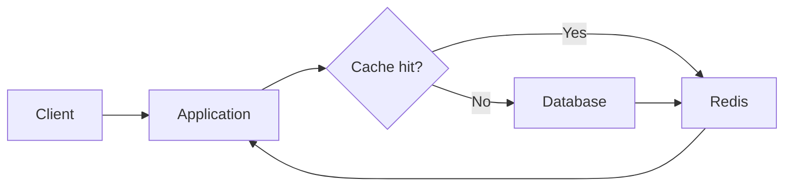

## 캐시가 필요한 지점 찾기

모든 조회를 캐시하기보다 호출 빈도가 높고, 원본 데이터의 변경 주기가 짧지 않은 경로부터 살펴봅니다.

### 측정할 항목

- 응답 시간의 평균보다 P95, P99 지연 시간
- 동일한 키에 대한 반복 조회 비율
- 데이터 변경 후 허용할 수 있는 지연 시간

## Cache Aside 적용

애플리케이션이 캐시를 먼저 확인하고 값이 없을 때 데이터베이스를 조회하는 방식을 사용했습니다.



```java
public Product findProduct(Long id) {
    return cache.get(id)
        .orElseGet(() -> cache.put(id, repository.findById(id).orElseThrow()));
}
```

### 무효화 기준

데이터가 변경되는 명령이 성공한 뒤 해당 키를 삭제합니다. TTL은 장애나 누락에 대비한 보조 장치로 사용합니다.

## 다시 확인할 점

캐시 적중률뿐 아니라 데이터 불일치 가능성, Redis 장애 시 데이터베이스에 몰리는 부하도 함께 관찰해야 합니다.
