## 1. DDD가 왜 필요한가

개발하다 보면 기획서와 코드의 용어가 다르고, 비즈니스 로직이 Controller와 Service 여러 곳에 흩어지는 문제가 생깁니다. 같은 단어를 팀마다 다르게 이해하거나 코드만 보고 어떤 비즈니스인지 파악하기 어려울 때도 있습니다.

DDD(Domain-Driven Design)는 비즈니스의 언어와 규칙을 코드에 직접 표현해 이러한 간극을 줄입니다.

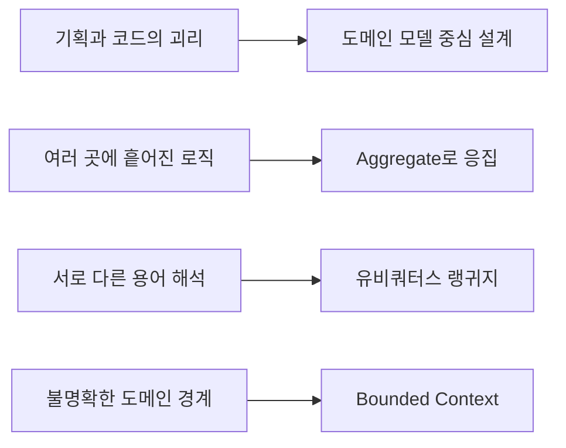

## 2. 도메인이란?

도메인은 소프트웨어가 해결하려는 비즈니스 영역입니다. 쇼핑몰에는 주문, 결제, 회원, 상품, 배송, 재고가 있고 은행에는 계좌, 이체, 대출, 예금이 있습니다.

DDD에서는 MySQL, JPA, Kafka 같은 기술보다 다음 질문을 먼저 다룹니다.

- 주문은 어떻게 생성되는가?
- 언제 주문을 취소할 수 있는가?
- 결제 완료의 조건은 무엇인가?

## 3. 전략적 설계와 전술적 설계

DDD는 크게 두 영역으로 나뉩니다.

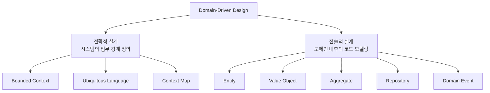

전략적 설계는 전체 시스템을 어떤 업무 경계로 나눌지 결정합니다. 전술적 설계는 각 경계 내부의 비즈니스 규칙을 객체로 표현합니다.

## 4. Bounded Context

Bounded Context는 **하나의 도메인 모델과 용어의 의미가 유효한 경계**입니다. 같은 고객이라는 말도 컨텍스트마다 필요한 의미가 다릅니다.

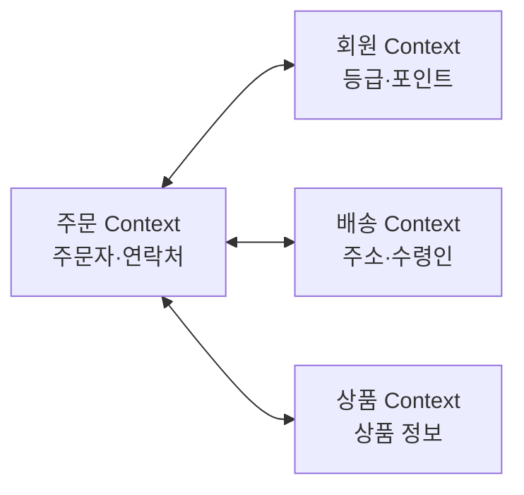

각 컨텍스트는 독립적인 모델을 가질 수 있습니다. 따라서 주문 컨텍스트의 `Customer`와 회원 컨텍스트의 `Member`가 반드시 같은 클래스일 필요는 없습니다.

## 5. 유비쿼터스 랭귀지

유비쿼터스 랭귀지는 개발자, 기획자, 도메인 전문가가 같은 비즈니스 용어를 사용하는 것입니다.

```java
// 의미를 알기 어렵다.
updateStatus(int code);

// 비즈니스 행위가 드러난다.
cancelOrder(CancelReason reason);
```

기획서에 “주문 취소”라고 쓰여 있다면 코드에도 `cancelOrder()`가 나타나는 것이 좋습니다. 코드만 읽어도 행위와 필요한 정보가 드러납니다.

## 6. Entity

Entity는 **고유한 식별자를 가지며 생명주기 동안 상태가 변하는 객체**입니다. 주문 금액이나 상태가 달라져도 주문 ID가 같으면 같은 주문입니다.

```java
public class Order {
    private final OrderId id;
    private OrderStatus status;
    private Money totalAmount;
}
```

대표적인 Entity에는 `Order`, `Member`, `Product`, `Account`가 있습니다.

## 7. Value Object

Value Object는 **식별자가 아니라 값 자체로 비교되는 불변 객체**입니다.

```java
public record Money(
    BigDecimal amount,
    Currency currency
) {
    public Money add(Money other) {
        return new Money(amount.add(other.amount), currency);
    }
}
```

두 `Money`의 금액과 통화가 같다면 같은 가치입니다. 기존 값을 변경하지 않고 새로운 객체를 반환하도록 만드는 것이 좋습니다.

## 8. Entity와 Value Object 차이

| 구분 | Entity | Value Object |
| --- | --- | --- |
| 비교 기준 | 식별자 | 값 |
| 상태 변경 | 가능 | 일반적으로 불변 |
| 생명주기 | 있음 | 별도 생명주기 없음 |
| 예시 | Order, Member | Money, Address |

쉽게 말하면 Entity는 **누구인가**, Value Object는 **어떤 값인가**가 중요합니다.

## 9. Aggregate

Aggregate는 관련된 Entity와 Value Object를 하나의 일관성 단위로 묶은 것입니다.

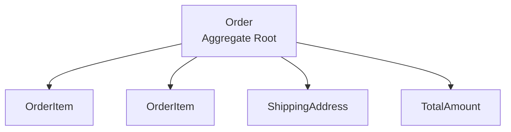

대표 객체인 `Order`가 Aggregate Root입니다. 외부에서는 내부의 `OrderItem`을 직접 수정하지 않고 Root를 통해 변경해야 합니다.

```java
// 피해야 할 방식
orderItem.changeQuantity(10);

// Aggregate Root를 통한 변경
order.changeItemQuantity(productId, 10);
```

## 10. Aggregate의 핵심 규칙

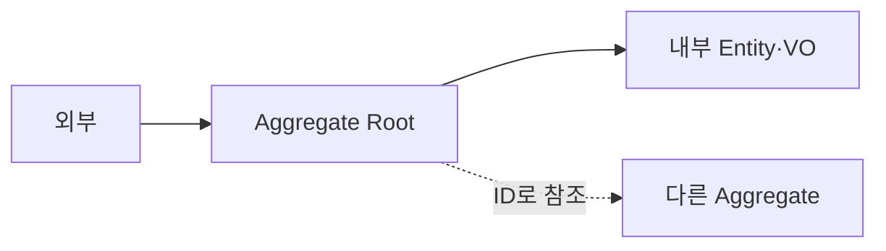

1. 외부에서는 Aggregate Root로만 접근합니다.
2. 하나의 트랜잭션에서는 하나의 Aggregate를 수정합니다.
3. 다른 Aggregate는 객체 대신 ID로 참조합니다.

여러 Aggregate를 한 트랜잭션에 강하게 묶으면 동시성과 트랜잭션 관리가 어려워집니다. 객체 대신 ID로 참조하면 Aggregate 간 결합도도 낮아집니다.

## 11. Repository

Repository는 Aggregate를 저장하고 조회하는 인터페이스입니다. Domain 또는 Application에 인터페이스를 두고 실제 기술 구현은 Infrastructure에 둡니다.

```java
public interface OrderRepository {
    Optional<Order> findById(OrderId id);
    void save(Order order);
    void delete(Order order);
}
```

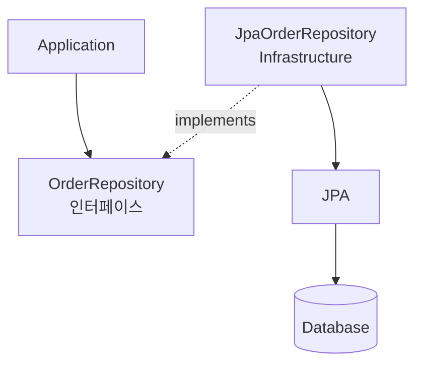

Domain과 Application은 JPA나 MySQL 같은 Infrastructure 기술을 알지 않습니다.

## 12. Domain Service

Domain Service는 특정 Entity나 Value Object 하나에 넣기 어려운 도메인 규칙을 담당합니다.

```java
public class DiscountPolicy {
    public Money calculate(MemberGrade grade, Money amount) {
        if (grade == MemberGrade.VIP
                && amount.isGreaterThanOrEqualTo(Money.won(50_000))) {
            return amount.multiply(0.1);
        }
        return Money.zeroWon();
    }
}
```

이 로직은 순수한 비즈니스 규칙이므로 HTTP나 JPA 같은 기술을 포함하지 않습니다.

## 13. Application Service

Application Service는 하나의 UseCase 흐름을 조율하는 계층입니다. 비즈니스 규칙을 직접 구현하기보다 Domain 객체에 위임하고 전체 순서를 관리합니다.

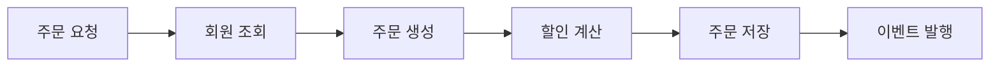

```java
public OrderId placeOrder(PlaceOrderCommand command) {
    Order order = Order.create(command.customerId());
    Money discount = discountPolicy.calculate(
        command.memberGrade(), command.totalAmount()
    );

    order.applyDiscount(discount);
    orderRepository.save(order);
    eventPublisher.publish(new OrderPlaced(order.getId()));
    return order.getId();
}
```

## 14. Domain Service와 Application Service 차이

| 구분 | Domain Service | Application Service |
| --- | --- | --- |
| 위치 | Domain | Application |
| 책임 | 비즈니스 규칙 | UseCase 흐름 조율 |
| 기술 의존 | 없음 | Port, 트랜잭션 등을 사용할 수 있음 |
| 예시 | 할인 계산 | 주문 생성 절차 |

Domain Service가 실제 요리를 하는 셰프라면 Application Service는 주문을 받고 순서를 관리하는 홀 매니저에 가깝습니다.

## 15. Domain Event

Domain Event는 도메인에서 이미 발생한 중요한 사건입니다. 이미 일어난 사실이므로 `OrderPlaced`, `PaymentCompleted`, `OrderCancelled`처럼 과거형으로 이름을 짓습니다.

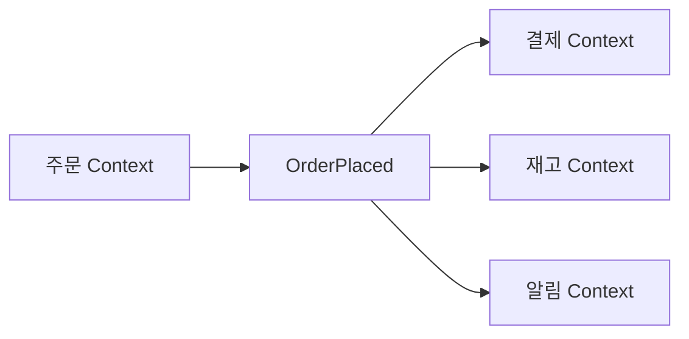

주문 컨텍스트는 결제나 알림 구현을 직접 알지 않고 이벤트만 발행합니다. 이를 통해 컨텍스트 사이의 결합을 낮출 수 있습니다.

## 16. Anti-Corruption Layer

외부 시스템의 모델을 그대로 가져오면 우리 도메인 모델이 오염될 수 있습니다. ACL(Anti-Corruption Layer)은 외부 모델을 내부 모델로 변환하고 번역합니다.

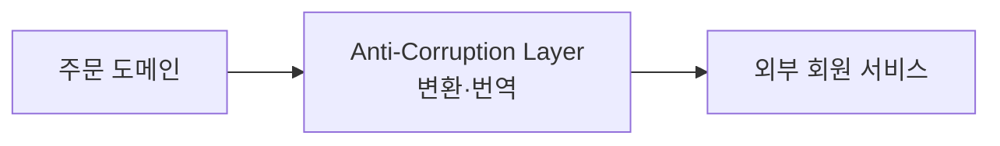

외부 서비스가 `UserResponse`를 반환하더라도 내부에서는 그대로 사용하지 않고 `CustomerInfo` 같은 우리 모델로 변환합니다.

## 17. DDD 4계층

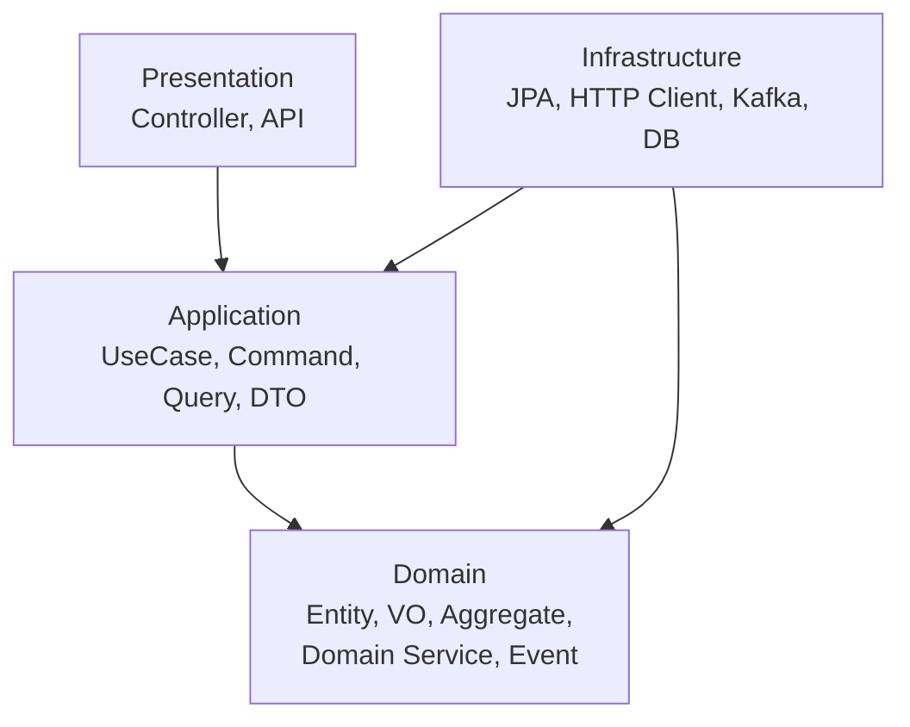

| 계층 | 책임 | 대표 구성 요소 |
| --- | --- | --- |
| Presentation | 외부 요청을 받고 Application 호출 | Controller, Request/Response DTO |
| Application | UseCase 실행 순서 조율 | Application Service, Command, Query, Port |
| Domain | 핵심 비즈니스 규칙 수행 | Entity, VO, Aggregate, Domain Event |
| Infrastructure | 기술적인 구현 | JPA, API Client, Kafka, Redis |

## 18. 의존성 방향

가장 중요한 원칙은 **안쪽 계층이 바깥쪽 기술 계층을 몰라야 한다**는 것입니다.

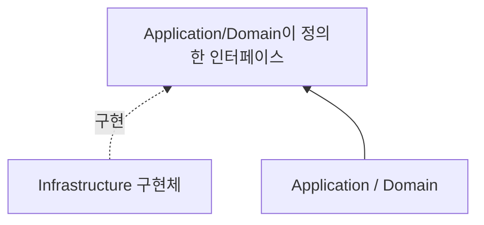

Domain은 JPA, MySQL, Kafka, Redis, HTTP, Spring MVC를 몰라야 합니다. 외부 기술이 안쪽 계층에서 정의한 인터페이스를 구현하도록 의존성을 역전합니다.

## 19. 패키지 구조 예시

```text
order
├── presentation
│   └── OrderController
├── application
│   ├── PlaceOrderService
│   ├── PlaceOrderCommand
│   ├── OrderResponse
│   └── port
│       ├── in
│       └── out
├── domain
│   ├── Order
│   ├── OrderItem
│   ├── OrderId
│   ├── Money
│   ├── OrderStatus
│   ├── DiscountPolicy
│   └── OrderPlaced
└── infrastructure
    ├── persistence
    │   ├── JpaOrderEntity
    │   ├── SpringDataOrderRepository
    │   └── JpaOrderRepositoryAdapter
    ├── client
    └── messaging
```

패키지만 보아도 각 코드의 역할과 의존 방향이 드러나는 구조입니다.

## 20. 실무 적용 시 주의점

- **핵심 도메인부터 적용합니다.** 비즈니스 규칙이 복잡하고 중요한 영역부터 시작합니다.
- **단순 CRUD에 과도하게 적용하지 않습니다.** 단순 조회와 등록은 일반적인 구조로도 충분할 수 있습니다.
- **유비쿼터스 랭귀지부터 시작합니다.** 기획서와 코드의 용어를 일치시키는 것만으로도 효과가 큽니다.
- **Aggregate를 작게 유지합니다.** 너무 큰 Aggregate는 트랜잭션 충돌과 성능 문제를 만들 수 있습니다.

## 전체 핵심 요약

| 개념 | 의미 |
| --- | --- |
| Domain | 소프트웨어가 해결하려는 비즈니스 영역 |
| Bounded Context | 모델과 용어의 의미가 유효한 경계 |
| Ubiquitous Language | 비즈니스와 코드에서 공통으로 사용하는 언어 |
| Entity | 식별자로 구분되는 객체 |
| Value Object | 값으로 비교되는 불변 객체 |
| Aggregate | 일관성을 보장하는 객체 묶음 |
| Aggregate Root | Aggregate의 외부 접근 창구 |
| Repository | Aggregate 저장·조회 인터페이스 |
| Domain Service | 특정 Entity에 속하지 않는 도메인 규칙 |
| Application Service | UseCase 실행 순서 조율 |
| Domain Event | 도메인에서 발생한 중요한 사건 |
| Infrastructure | DB, HTTP, 메시징 같은 기술 구현 |

## 최종 암기 문장

> DDD는 비즈니스의 언어와 규칙을 코드에 그대로 표현하고, 복잡한 도메인을 명확한 경계와 모델로 나누어 관리하는 설계 방식입니다.

- Presentation: 요청을 받습니다.
- Application: UseCase의 순서를 조율합니다.
- Domain: 핵심 비즈니스 규칙을 수행합니다.
- Infrastructure: 기술적으로 구현합니다.

DDD의 핵심은 클래스를 많이 만드는 것이 아니라, **코드를 읽었을 때 실제 비즈니스가 그대로 보이게 만드는 것**입니다.
