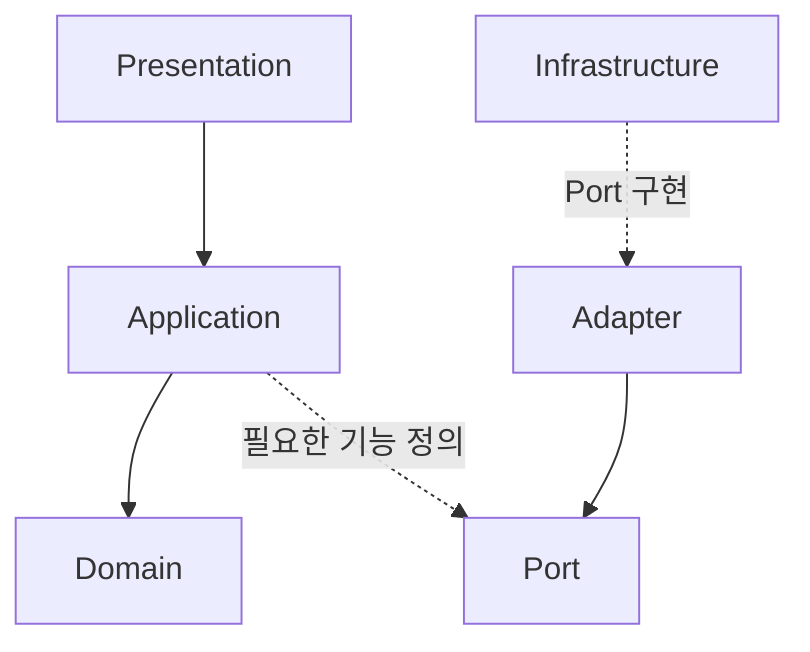
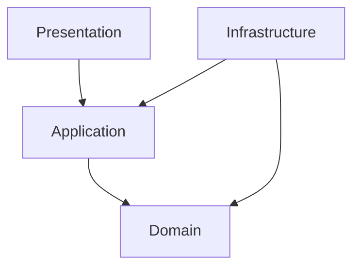
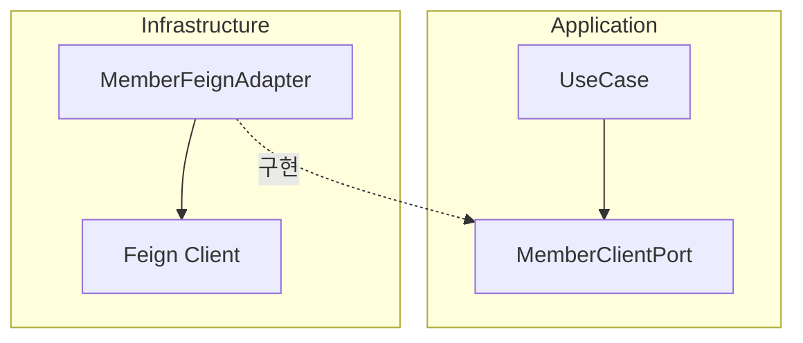
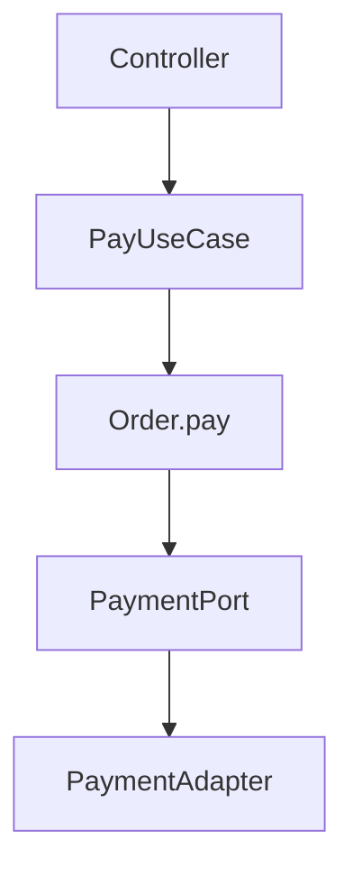
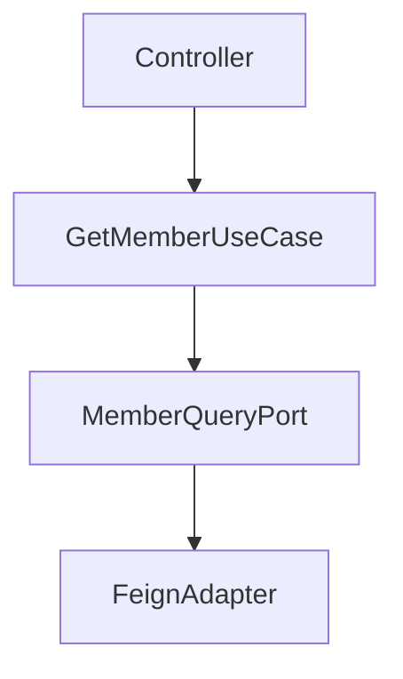
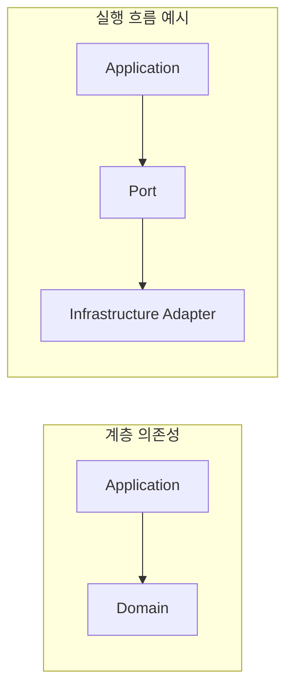
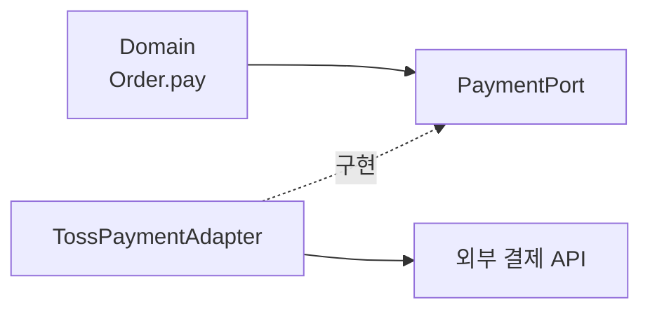

## 1. DDD 4계층과 헥사고날은 경쟁 관계가 아니다

많은 사람이 “DDD를 사용할까, 헥사고날을 사용할까?”라고 고민하지만 둘은 경쟁 관계가 아닙니다. 헥사고날은 DDD의 계층을 유지하면서 외부 기술과의 경계를 명확히 만드는 아키텍처 패턴입니다.



DDD의 Presentation, Application, Domain, Infrastructure 계층은 그대로 유지됩니다. 여기에 Port와 Adapter라는 경계 개념이 추가됩니다.

---

## 2. DDD에서 권장하는 의존성



| 계층 | 역할 |
| --- | --- |
| Presentation | 요청을 받아 Application을 호출한다. |
| Application | 비즈니스 시나리오를 수행한다. |
| Domain | 핵심 비즈니스 규칙을 수행한다. |
| Infrastructure | DB, HTTP, Kafka 같은 기술을 구현한다. |

핵심은 Infrastructure가 Application과 Domain을 의존한다는 점입니다. 비즈니스 계층이 기술 계층을 직접 의존하지 않습니다.

---

## 3. 왜 Port를 Application에 둘까?

회원 정보를 가져오는 기능이 필요하다고 가정해 보겠습니다. Application은 필요한 기능만 인터페이스로 정의합니다.

```java
public interface MemberClientPort {
    MemberInfo getMember(Long memberId);
}
```

실제 HTTP 호출은 Infrastructure의 Adapter가 구현합니다.

```java
public class MemberFeignClient implements MemberClientPort {
    // Feign을 사용한 외부 API 호출
}
```



Application은 HTTP, Feign, WebClient를 알지 못합니다. 다음 호출만 알고 있습니다.

```java
memberClientPort.getMember(memberId);
```

기술 구현체가 비즈니스 계층에 선언된 인터페이스를 의존하는 구조가 DIP(의존성 역전 원칙)입니다.

---

## 4. Application은 Domain을 반드시 거쳐야 할까?

아닙니다. UseCase가 Domain을 거치는지는 해당 기능에 비즈니스 규칙이 있는지에 따라 달라집니다.

### 결제처럼 비즈니스 규칙이 있는 경우



결제 상태 변경이나 결제 가능 여부 같은 규칙이 있으므로 Domain이 흐름에 참여합니다.

### 단순 회원 조회처럼 비즈니스 규칙이 없는 경우



단순 조회에 별도의 비즈니스 규칙이 없다면 Domain을 거치지 않아도 됩니다. Application이 항상 Domain을 호출해야 하는 것은 아닙니다.

---

## 5. 계층 의존성과 실행 흐름은 다르다

계층 의존성은 코드가 어떤 방향을 참조할 수 있는지를 나타냅니다. 실행 흐름은 특정 요청이 런타임에 어떤 객체를 거치는지를 나타냅니다.



Application은 Domain을 사용할 수 있지만, 모든 UseCase가 실행될 때 Domain을 반드시 거쳐야 하는 것은 아닙니다.

---

## 6. Domain이 HTTP를 호출하면 안 되는 이유

다음과 같이 Domain이 기술 객체를 직접 보유하면 좋지 않습니다.

```java
public class Order {
    private WebClient webClient;
}
```

Domain이 Spring, HTTP, JPA, Kafka 같은 기술을 알게 되어 핵심 규칙과 외부 구현이 강하게 결합되기 때문입니다.

Domain은 비즈니스 규칙만 가져야 합니다.

```java
public class Order {
    public void pay() {
        // 결제 가능 여부와 상태 변경 같은 비즈니스 규칙
    }
}
```



---

## 7. DDD와 헥사고날에서 많이 사용하는 구조

```text
src
├── presentation
│   └── MemberController
│
├── application
│   ├── usecase
│   │   └── RegisterMemberUseCase
│   └── port
│       ├── in
│       └── out
│
├── domain
│   ├── Member
│   ├── Order
│   └── Payment
│
└── infrastructure
    ├── persistence
    │   ├── MemberJpaAdapter
    │   └── MemberJpaRepository
    ├── client
    │   └── MemberFeignAdapter
    └── kafka
```

---

## 헥사고날을 이해하는 가장 쉬운 문장

| 계층 | 한 문장 |
| --- | --- |
| Presentation | **요청을 받는다.** |
| Application | **무슨 일을 할지 결정한다.** |
| Domain | **비즈니스 규칙을 수행한다.** |
| Port | **무엇이 필요한지만 정의한다.** |
| Adapter | **실제로 어떻게 할지 구현한다.** |
| Infrastructure | **DB, HTTP, Kafka 같은 기술을 담당한다.** |

---

## 핵심 암기 포인트

헥사고날에서 가장 중요한 원칙은 다음과 같습니다.

> **비즈니스(Application + Domain)는 기술(Infrastructure)을 몰라야 합니다.**

Application은 다음 Port 호출만 알고 있습니다.

```java
paymentPort.pay();
```

Infrastructure는 Port의 실제 구현체를 제공합니다.

```java
public class TossPaymentAdapter implements PaymentPort {
}
```

비즈니스는 **무엇을 할지**를 알고, 기술은 **어떻게 할지**를 담당하는 것이 DDD와 헥사고날 아키텍처를 함께 적용하는 핵심입니다.
