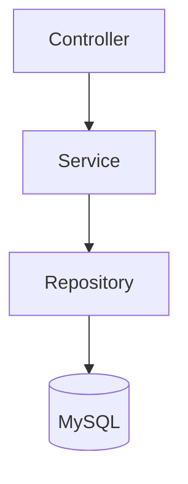
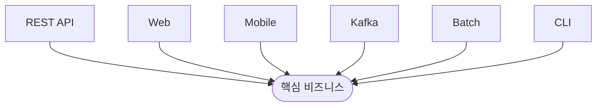
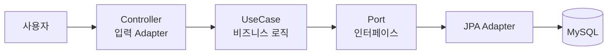
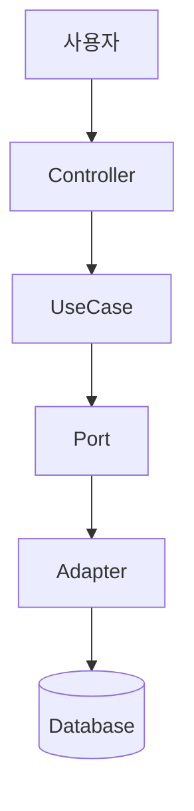
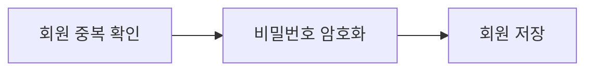
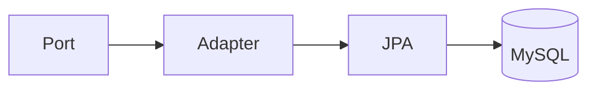
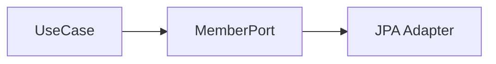
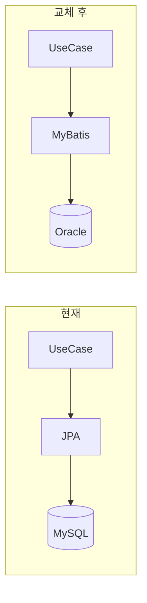
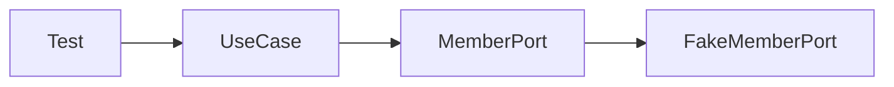
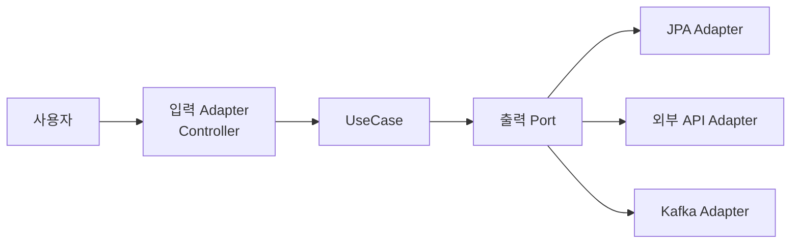

## 한 줄로 이해하기

> 핵심 비즈니스(도메인)는 가운데 두고 DB, API, 웹 같은 외부 기술은 교체 가능하게 만드는 아키텍처입니다.

회원가입 기능을 만든다고 생각해 보겠습니다. 회원가입을 하려면 웹에서 요청을 받고, 회원 정보를 저장한 다음 응답을 보냅니다.

일반적인 계층형 구조는 다음과 같습니다.



이 구조는 간단하지만 나중에 `MySQL → MongoDB`, `JPA → MyBatis`로 변경하면 Service도 영향을 받을 수 있습니다. 이러한 결합을 줄이기 위해 헥사고날 아키텍처를 사용합니다.

---

## 왜 이름이 헥사고날(육각형)일까?

육각형이라는 모양 자체가 중요한 것은 아닙니다. 여러 방향에서 핵심 비즈니스 로직에 연결될 수 있음을 표현하기 위한 형태입니다.



REST API, 웹, 모바일, Kafka, Batch, CLI가 모두 같은 비즈니스 로직을 사용할 수 있습니다.

---

## 전체 구조



요청은 다음 순서로 흐릅니다.



---

## 각 역할 이해하기

### 1. Controller

사용자의 요청을 받습니다.

```http
POST /members
```

회원가입 요청이 들어오면 Controller는 요청을 애플리케이션에 전달하는 역할까지만 담당합니다.

### 2. UseCase

핵심 비즈니스 규칙을 수행하는 가장 중요한 영역입니다.



UseCase는 DB가 MySQL인지 MongoDB인지 알 필요가 없습니다.

### 3. Port

Port는 애플리케이션이 필요로 하는 기능을 정의한 인터페이스입니다.

```java
public interface MemberPort {
    void save(Member member);
}
```

UseCase는 `save()` 기능이 필요하다는 사실만 알고, 누가 어떻게 구현하는지는 모릅니다.

### 4. Adapter

Adapter는 Port를 실제 기술로 구현합니다.

```java
public class MemberJpaAdapter implements MemberPort {
    // Port의 기능을 JPA로 구현합니다.
}
```

Adapter 내부에서는 실제 Repository를 호출합니다.

```java
memberJpaRepository.save(member);
```



---

## 왜 Port를 만드는 걸까?

UseCase가 다음 코드를 직접 호출하면 UseCase가 JPA라는 기술을 알게 됩니다.

```java
memberJpaRepository.save(member);
```

헥사고날 아키텍처에서는 기술 구현체 대신 Port를 호출합니다.

```java
memberPort.save(member);
```



UseCase의 관점에서는 “누가 저장하는지는 모르겠고, 저장 기능만 수행해 줘”라고 요청하는 셈입니다.

---

## 왜 좋은가?

### ① DB를 쉽게 교체할 수 있다



구현 기술이 바뀌어도 UseCase가 의존하는 Port는 유지되므로 핵심 비즈니스 로직을 수정하지 않아도 됩니다.

### ② 테스트하기 쉽다

DB Adapter 대신 `FakeMemberPort`를 주입하면 실제 DB 없이도 UseCase를 테스트할 수 있습니다.



### ③ 유지보수가 쉽다

비즈니스 영역은 회원가입 규칙을, 기술 영역은 DB 저장과 외부 연동을 담당합니다. 역할과 변경 이유가 명확하게 분리됩니다.

---

## 입력과 출력도 따로 생각한다

헥사고날 아키텍처는 **입력(Inbound)** 과 **출력(Outbound)** 을 구분합니다.



입력 Adapter에는 Controller, REST API, Batch 등이 올 수 있습니다. 출력 Adapter에는 DB, Redis, Kafka, 외부 API 등이 올 수 있습니다.

---

## 실무 프로젝트 구조 예시

```text
src
 ├── domain
 │     ├── Member
 │     └── MemberPort
 │
 ├── application
 │     └── RegisterMemberUseCase
 │
 ├── adapter
 │     ├── in
 │     │      └── MemberController
 │     │
 │     └── out
 │            └── MemberJpaAdapter
 │
 └── infrastructure
        └── MemberJpaRepository
```

---

## 시험이나 면접에서 외우기 좋은 핵심

| 구성 요소 | 역할 |
| --- | --- |
| **Controller (Input Adapter)** | 사용자 요청을 받는다. |
| **UseCase (Application)** | 비즈니스 로직을 수행한다. |
| **Port (Interface)** | 필요한 기능을 인터페이스로 정의한다. |
| **Adapter** | Port를 실제 기술(JPA, API 등)로 구현한다. |
| **Database / 외부 시스템** | 데이터를 저장하거나 외부와 통신한다. |

---

## 암기 포인트

헥사고날 아키텍처를 한 문장으로 기억하면 됩니다.

> **비즈니스 로직은 가운데에 두고, Port(인터페이스)를 통해 외부 기술과 연결하여 DB나 API가 바뀌어도 핵심 로직은 변경되지 않도록 만드는 아키텍처입니다.**

이 문장을 이해하면 헥사고날 아키텍처의 핵심 개념을 대부분 이해한 것입니다.
