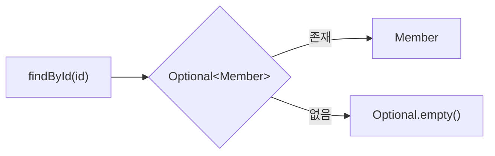
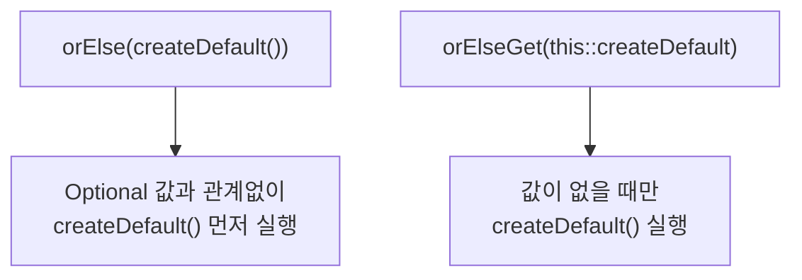
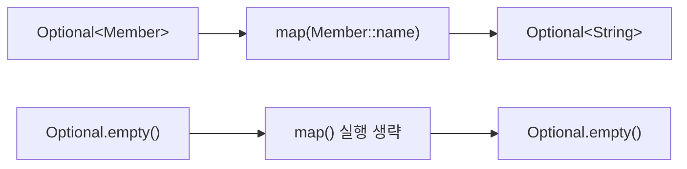
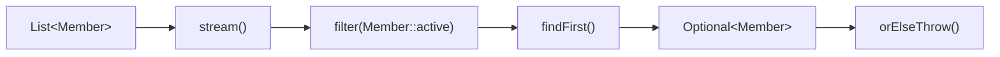
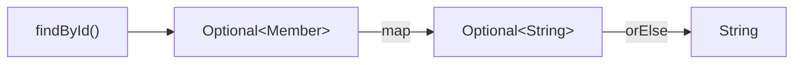

## 1. Optional이란?

Optional은 **값이 있을 수도 있고 없을 수도 있음을 표현하는 컨테이너**입니다. Java 8 이전에는 조회 결과가 없을 때 주로 `null`을 반환했습니다.

```java
Member member = repository.findById(1L);
System.out.println(member.getName());
```

회원이 없어 `member`가 `null`이라면 `member.getName()`에서 `NullPointerException`이 발생합니다. Optional은 “값이 없을 수 있다”는 사실을 반환 타입에 드러냅니다.



Optional은 null을 무조건 없애는 도구가 아니라 **값 부재 가능성을 API 계약으로 표현하는 도구**입니다.

## 2. Optional 생성

### `of()`

값이 반드시 존재한다고 확신할 때 사용합니다.

```java
Optional<String> name = Optional.of("Kim");
```

`Optional.of(null)`은 즉시 `NullPointerException`을 발생시킵니다.

### `ofNullable()`

값이 null일 수 있을 때 사용합니다.

```java
String name = findName();
Optional<String> optional = Optional.ofNullable(name);
```

`name`이 null이면 `Optional.empty()`가 됩니다.

### `empty()`

```java
Optional<String> optional = Optional.empty();
```

명시적으로 빈 Optional을 반환할 때 사용합니다.

## 3. `get()`을 피해야 하는 이유

```java
Optional<String> name = Optional.of("Kim");
System.out.println(name.get());
```

값이 있으면 동작하지만 `Optional.empty().get()`은 `NoSuchElementException`을 발생시킵니다. 존재 여부를 확인하지 않은 `get()`은 null을 직접 사용하는 것과 비슷한 위험을 다시 만듭니다.

실무에서는 목적에 맞게 `orElse()`, `orElseGet()`, `orElseThrow()`를 사용합니다.

## 4. 기본값과 예외 처리

### `orElse()`

값이 없을 때 기본값을 반환합니다.

```java
String result = Optional.<String>empty()
    .orElse("Unknown");
```

### `orElseGet()`

Supplier를 받아 값이 없을 때만 기본값을 생성합니다.

```java
Member member = optional.orElseGet(this::createDefaultMember);
```

두 메서드의 중요한 차이는 평가 시점입니다.



```java
Member first = optional.orElse(createDefaultMember());
Member second = optional.orElseGet(this::createDefaultMember);
```

기본값 생성 비용이 크거나 DB·외부 API 호출 같은 부수 효과가 있다면 `orElseGet()`을 사용합니다.

### `orElseThrow()`

값이 반드시 필요하다면 의미 있는 예외를 던집니다.

```java
Member member = optional.orElseThrow(
    () -> new MemberNotFoundException("회원이 없습니다.")
);
```

인자 없는 `orElseThrow()`는 Java 10부터 제공되며 값이 없으면 `NoSuchElementException`을 던집니다. Java 8에서는 예외 Supplier를 받는 형태를 사용합니다.

## 5. 값이 있을 때만 처리하기

### `ifPresent()`

```java
Optional<String> name = Optional.of("Kim");
name.ifPresent(System.out::println);
```

값이 비어 있으면 아무 작업도 하지 않습니다.

### `ifPresentOrElse()`

Java 9부터 값이 있을 때와 없을 때의 동작을 함께 정의할 수 있습니다.

```java
optional.ifPresentOrElse(
    System.out::println,
    () -> System.out.println("값이 없습니다.")
);
```

## 6. `map()`으로 값 변환하기

```java
Optional<Member> member = Optional.of(
    new Member(1L, "Kim", 20)
);

Optional<String> name = member.map(Member::name);
```

값이 있으면 함수를 적용하고, 비어 있으면 `Optional.empty()`를 유지합니다.



```java
String name = member
    .map(Member::name)
    .orElse("없음");
```

## 7. `filter()`와 `flatMap()`

Optional도 조건 검사와 중첩 Optional 평탄화를 지원합니다.

```java
Member adult = optionalMember
    .filter(member -> member.age() >= 20)
    .orElseThrow(MemberNotFoundException::new);
```

매핑 함수가 일반 값을 반환하면 `map()`을, Optional을 반환하면 `flatMap()`을 사용합니다.

```java
Optional<Address> address = memberRepository.findById(id)
    .flatMap(Member::address);
```

`map(Member::address)`를 사용하면 `Optional<Optional<Address>>`가 될 수 있지만 `flatMap()`은 `Optional<Address>`로 평탄화합니다.

## 8. Stream과 Optional

Stream의 일부 최종 연산은 결과가 없을 가능성이 있어 Optional을 반환합니다.

```java
Optional<Member> member = members.stream()
    .filter(Member::active)
    .findFirst();
```



```java
Member activeMember = members.stream()
    .filter(Member::active)
    .findFirst()
    .orElseThrow(MemberNotFoundException::new);
```

## 9. Spring Data JPA에서 사용하기

Spring Data JPA의 단건 조회는 값이 없을 수 있으므로 Optional과 잘 맞습니다.

```java
public interface MemberRepository {
    Optional<Member> findById(Long id);
}
```

Service에서는 의미 있는 도메인 예외로 변환합니다.

```java
Member member = memberRepository.findById(id)
    .orElseThrow(() -> new MemberNotFoundException(id));
```

필요한 값만 변환하고 기본값을 제공할 수도 있습니다.

```java
String name = memberRepository.findById(id)
    .map(Member::name)
    .orElse("탈퇴회원");
```

## 10. Optional 체이닝의 타입 흐름

```java
String name = memberRepository.findById(id)
    .map(Member::name)
    .orElse("Unknown");
```



체이닝은 각 단계의 입력과 반환 타입을 따라 읽으면 이해하기 쉽습니다.

## 11. Optional 사용 시 주의사항

### 반환 타입에 사용한다

```java
Optional<Member> findById(Long id);
```

호출자에게 결과가 없을 수 있음을 명시적으로 전달합니다.

### Entity 필드에 사용하지 않는다

```java
class Member {
    private Optional<String> name; // 권장하지 않는다.
}
```

Optional은 직렬화를 위한 타입이 아니며 JPA 매핑과도 잘 맞지 않습니다. 필드 자체는 실제 타입으로 두고 도메인 규칙에 따라 null 허용 여부를 관리합니다.

### DTO 필드에 사용하지 않는다

```java
record MemberResponse(
    Optional<String> name // 권장하지 않는다.
) {
}
```

JSON 직렬화 결과가 라이브러리 설정에 의존하고 API 계약도 복잡해집니다. 필드 생략, null, 별도 응답 모델 등 명확한 API 정책을 사용합니다.

### 매개변수와 컬렉션 요소에 남용하지 않는다

```java
void update(Optional<String> name);       // 보통 권장하지 않는다.
List<Optional<Member>> members;           // 보통 권장하지 않는다.
```

매개변수는 overload나 명시적 타입을 사용하고, 컬렉션은 존재하는 값만 담는 편이 자연스럽습니다.

## 12. 자주 사용하는 패턴

### 기본값 반환

```java
Member member = optional.orElse(defaultMember);
```

### 값이 없으면 지연 생성

```java
Member member = optional.orElseGet(this::createDefaultMember);
```

### 반드시 존재해야 하는 값

```java
Member member = optional.orElseThrow(MemberNotFoundException::new);
```

### 값이 있을 때만 처리

```java
optional.ifPresent(this::sendNotification);
```

### 값 변환

```java
String name = optional
    .map(Member::name)
    .orElse("없음");
```

## 13. 주요 메서드 정리

| 메서드 | 설명 | 실무 사용 빈도 |
| --- | --- | --- |
| `of()` | non-null 값으로 생성 | ⭐⭐☆☆☆ |
| `ofNullable()` | null 가능 값으로 생성 | ⭐⭐⭐⭐☆ |
| `empty()` | 빈 Optional 생성 | ⭐⭐☆☆☆ |
| `orElse()` | 준비된 기본값 반환 | ⭐⭐⭐⭐☆ |
| `orElseGet()` | 필요할 때 기본값 생성 | ⭐⭐⭐⭐☆ |
| `orElseThrow()` | 값이 없으면 예외 | ⭐⭐⭐⭐⭐ |
| `ifPresent()` | 값이 있을 때 실행 | ⭐⭐⭐☆☆ |
| `ifPresentOrElse()` | 존재·부재 동작 분기 | ⭐⭐☆☆☆ |
| `map()` | 내부 값 변환 | ⭐⭐⭐⭐⭐ |
| `flatMap()` | 중첩 Optional 평탄화 | ⭐⭐⭐⭐☆ |
| `filter()` | 조건을 만족하는 값만 유지 | ⭐⭐⭐☆☆ |

## Optional 핵심 TOP 5

| 순위 | 메서드 | 용도 |
| --- | --- | --- |
| ⭐⭐⭐⭐⭐ | `orElseThrow()` | 값이 반드시 필요할 때 |
| ⭐⭐⭐⭐⭐ | `map()` | 내부 값 변환 |
| ⭐⭐⭐⭐☆ | `orElseGet()` | 비용이 있는 기본값 지연 생성 |
| ⭐⭐⭐⭐☆ | `flatMap()` | Optional 반환 연산 연결 |
| ⭐⭐⭐☆☆ | `ifPresent()` | 값이 있을 때만 처리 |

## 핵심 정리

- Optional은 값의 부재 가능성을 반환 타입으로 표현합니다.
- 무조건 `get()`으로 꺼내지 않고 목적에 맞는 종료 연산을 사용합니다.
- `orElse()`는 기본값을 미리 평가하고 `orElseGet()`은 필요할 때만 생성합니다.
- `map()`과 `flatMap()`을 사용하면 명시적인 null 검사 없이 안전하게 변환할 수 있습니다.
- Entity와 DTO의 필드보다는 메서드 반환 타입에 사용하는 것이 적절합니다.

Optional의 핵심은 null을 감추는 것이 아니라 **호출자가 값이 없는 상황을 반드시 고려하도록 API를 설계하는 것**입니다.
