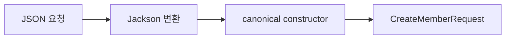
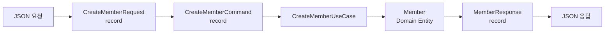

## 1. record란?

`record`는 **값을 담는 불변 데이터 객체를 간결하게 만들기 위한 Java 문법**입니다. Java 14에서 preview로 도입됐고 Java 16에서 정식 기능이 됐습니다.

기존 클래스에서는 필드, 생성자, 접근자, `equals()`, `hashCode()`, `toString()`을 직접 작성해야 합니다.

```java
public class MemberRequest {
    private final String name;
    private final int age;

    public MemberRequest(String name, int age) {
        this.name = name;
        this.age = age;
    }

    public String getName() { return name; }
    public int getAge() { return age; }
}
```

record를 사용하면 다음처럼 줄일 수 있습니다.

```java
public record MemberRequest(
    String name,
    int age
) {
}
```

이 선언만으로 다음 요소가 자동 생성됩니다.

- 모든 컴포넌트를 받는 canonical constructor
- 각 컴포넌트의 접근 메서드
- `equals()`와 `hashCode()`
- `toString()`

## 2. getter 사용법이 다르다

일반 클래스의 getter에는 보통 `get`이 붙지만 record의 접근 메서드는 컴포넌트 이름과 같습니다.

```java
MemberRequest request = new MemberRequest("영진", 25);

System.out.println(request.name());
System.out.println(request.age());
```

`getName()`이나 `getAge()`가 아니라 `name()`과 `age()`를 사용합니다.

## 3. record는 기본적으로 불변이다

record의 컴포넌트는 내부적으로 `private final` 필드가 됩니다. setter도 생성되지 않으므로 생성 후 값을 바꿀 수 없습니다.

```java
MemberRequest oldRequest = new MemberRequest("영진", 25);

MemberRequest newRequest = new MemberRequest(
    "철수",
    oldRequest.age()
);
```

값을 바꾸려면 기존 객체를 수정하는 대신 새로운 record를 생성합니다.

## 4. Spring에서는 어디에 사용할까?

record는 다음과 같이 데이터를 전달하고 표현하는 위치에 잘 어울립니다.

- Request DTO
- Response DTO
- Command와 Query
- 외부 API 응답 객체
- 설정값 객체
- 불변 Value Object

특히 Spring의 입출력 DTO에서 반복 코드를 크게 줄일 수 있습니다.

## 5. Request DTO

```java
public record CreateMemberRequest(
    String name,
    String email,
    int age
) {
}
```

```java
@RestController
@RequestMapping("/members")
public class MemberController {

    @PostMapping
    public void createMember(
        @RequestBody CreateMemberRequest request
    ) {
        System.out.println(request.name());
        System.out.println(request.email());
        System.out.println(request.age());
    }
}
```

요청 JSON은 Spring의 JSON 변환기를 거쳐 record의 생성자로 전달됩니다.

```json
{
  "name": "김영진",
  "email": "test@example.com",
  "age": 25
}
```



## 6. Response DTO

응답 객체도 record로 표현할 수 있습니다.

```java
public record MemberResponse(
    Long id,
    String name,
    String email
) {
}
```

```java
@GetMapping("/{id}")
public MemberResponse getMember(@PathVariable Long id) {
    return new MemberResponse(id, "김영진", "test@example.com");
}
```

Spring은 record의 컴포넌트를 다음과 같은 JSON으로 직렬화합니다.

```json
{
  "id": 1,
  "name": "김영진",
  "email": "test@example.com"
}
```

## 7. Bean Validation

record 컴포넌트에도 Bean Validation 제약 조건을 선언할 수 있습니다.

```java
public record CreateMemberRequest(
    @NotBlank String name,
    @Email @NotBlank String email,
    @Min(1) int age
) {
}
```

```java
@PostMapping
public void createMember(
    @Valid @RequestBody CreateMemberRequest request
) {
}
```

Spring Boot 3에서는 `jakarta.validation` 패키지를 사용합니다.

```java
import jakarta.validation.constraints.Email;
import jakarta.validation.constraints.Min;
import jakarta.validation.constraints.NotBlank;
```

## 8. compact constructor

record 내부에서 생성 시점의 불변 조건을 검사할 수 있습니다.

```java
public record Money(long amount) {

    public Money {
        if (amount < 0) {
            throw new IllegalArgumentException(
                "금액은 0보다 작을 수 없습니다."
            );
        }
    }
}
```

`public Money {}`처럼 매개변수 목록을 생략한 생성자를 **compact constructor**라고 합니다. 컴포넌트의 필드 대입은 컴파일러가 자동으로 처리합니다.

## 9. 정적 팩토리 메서드

record에도 정적 팩토리 메서드를 선언할 수 있습니다. Entity를 Response DTO로 변환할 때 유용합니다.

```java
public record MemberResponse(
    Long id,
    String name,
    String email
) {
    public static MemberResponse from(Member member) {
        return new MemberResponse(
            member.getId(),
            member.getName(),
            member.getEmail()
        );
    }
}
```

```java
Member member = memberService.findById(id);
return MemberResponse.from(member);
```

## 10. 인스턴스 메서드와 static 멤버

record는 단순한 데이터 보관함이 아닙니다. 상태를 변경하지 않는 행위와 static 멤버를 가질 수 있습니다.

```java
public record Money(long amount) {
    public static final Money ZERO = new Money(0);

    public static Money won(long amount) {
        return new Money(amount);
    }

    public Money add(Money other) {
        return new Money(amount + other.amount);
    }

    public boolean isPositive() {
        return amount > 0;
    }
}
```

## 11. 인터페이스 구현과 상속 제한

record는 인터페이스를 구현할 수 있습니다.

```java
public interface Command {
}

public record CreateMemberCommand(
    String name,
    String email
) implements Command {
}
```

하지만 다른 클래스를 상속할 수는 없습니다. 모든 record는 내부적으로 `java.lang.Record`를 상속하며 암묵적으로 final이기 때문입니다.

## 12. JPA Entity로 사용해도 될까?

일반적으로 **JPA Entity에는 record를 사용하지 않는 것이 좋습니다.** JPA Entity는 보통 기본 생성자, 프록시 생성, 상태 변경, 지연 로딩과 생명주기 관리가 필요합니다. 불변이고 상속이 제한된 record와 잘 맞지 않습니다.

```java
@Entity
public class MemberEntity {
    @Id
    @GeneratedValue
    private Long id;

    private String name;
}
```

```java
public record MemberResponse(
    Long id,
    String name
) {
}
```

| 대상 | 권장 형태 |
| --- | --- |
| JPA Entity | 일반 class |
| 상태가 변하는 Domain Entity | 일반 class |
| Request·Response DTO | record |
| Command·Query | record |
| 불변 Value Object | record |

## 13. DDD의 Value Object로 사용하기

`Money`, `Address`, `Email`처럼 불변이고 값으로 비교되는 객체는 record와 잘 맞습니다.

```java
public record Email(String value) {

    public Email {
        if (value == null || !value.contains("@")) {
            throw new IllegalArgumentException(
                "올바른 이메일 형식이 아닙니다."
            );
        }
    }
}
```

DDD 계층별로 구분하면 다음과 같습니다.

```text
presentation
├── CreateMemberRequest.java  → record
└── MemberResponse.java       → record

application
├── CreateMemberCommand.java  → record
└── FindMemberQuery.java      → record

domain
├── Member.java               → class
├── Email.java                → record
└── Money.java                → record

infrastructure
└── MemberJpaEntity.java      → class
```

## 14. 컬렉션은 자동으로 불변이 아니다

record 필드 자체는 다른 객체로 교체할 수 없지만, 내부의 가변 컬렉션까지 자동으로 불변이 되는 것은 아닙니다.

```java
List<Long> ids = new ArrayList<>();
ids.add(1L);

OrderRequest request = new OrderRequest(ids);
ids.add(2L); // request 내부에도 반영된다.
```

진짜 불변으로 만들려면 생성자에서 방어적 복사를 해야 합니다.

```java
public record OrderRequest(
    List<Long> productIds
) {
    public OrderRequest {
        productIds = List.copyOf(productIds);
    }
}
```

`Map`과 `Set`도 각각 `Map.copyOf()`, `Set.copyOf()`를 사용할 수 있습니다.

## 15. null은 자동으로 막히지 않는다

record도 기본적으로 `null`을 허용합니다. 필요하다면 직접 검사하거나 Bean Validation을 사용해야 합니다.

```java
public record MemberRequest(
    String name,
    int age
) {
    public MemberRequest {
        Objects.requireNonNull(name, "name은 필수입니다.");
    }
}
```

요청 DTO라면 `@NotBlank`, `@NotNull` 같은 제약 조건이 더 자연스러울 수 있습니다.

## 16. record와 Lombok 비교

```java
@Getter
@AllArgsConstructor
public class MemberResponse {
    private final Long id;
    private final String name;
}
```

```java
public record MemberResponse(
    Long id,
    String name
) {
}
```

record는 Java 표준 문법이며 DTO가 불변 데이터 객체라는 의도를 명확하게 표현합니다. 반면 변경 가능한 객체, 상속이 필요한 객체, setter가 필요한 객체에는 일반 class가 더 적합합니다.

## 17. Request부터 Response까지 전체 흐름

```java
public record CreateMemberRequest(
    @NotBlank String name,
    @Email @NotBlank String email
) {
}
```

```java
public record CreateMemberCommand(
    String name,
    String email
) {
    public static CreateMemberCommand from(
        CreateMemberRequest request
    ) {
        return new CreateMemberCommand(
            request.name(), request.email()
        );
    }
}
```

```java
public record MemberResponse(
    Long id,
    String name,
    String email
) {
    public static MemberResponse from(Member member) {
        return new MemberResponse(
            member.getId(), member.getName(), member.getEmail()
        );
    }
}
```

```java
@RestController
@RequestMapping("/members")
@RequiredArgsConstructor
public class MemberController {
    private final CreateMemberUseCase createMemberUseCase;

    @PostMapping
    public MemberResponse createMember(
        @Valid @RequestBody CreateMemberRequest request
    ) {
        CreateMemberCommand command =
            CreateMemberCommand.from(request);
        Member member = createMemberUseCase.create(command);
        return MemberResponse.from(member);
    }
}
```



## 핵심 정리

> record는 값을 담는 불변 데이터 객체를 짧고 명확하게 표현하는 Java 문법입니다.

Spring에서는 Request DTO, Response DTO, Command, Query, 외부 API 응답 객체와 Value Object에 잘 어울립니다. 반면 JPA Entity, 상태가 자주 변하는 Domain Entity, 상속이나 setter가 필요한 객체는 일반 class가 더 적합합니다.

처음 연습할 때는 `Request DTO → Command → Response DTO` 흐름을 모두 record로 만들어 보면 용도와 장점을 빠르게 이해할 수 있습니다.
