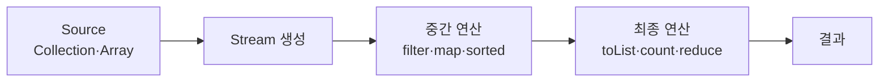
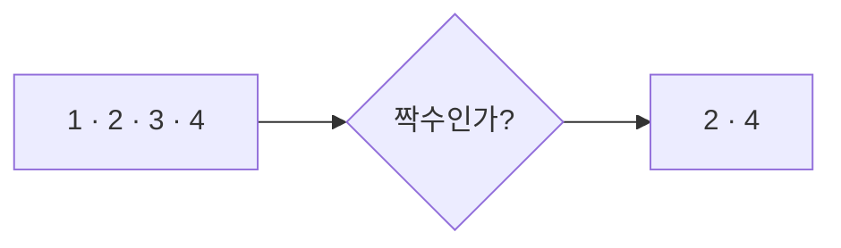
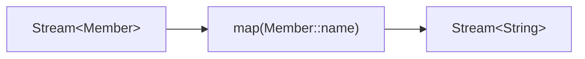
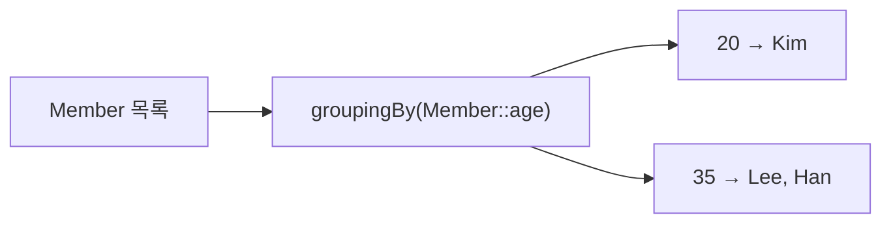
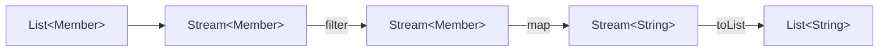
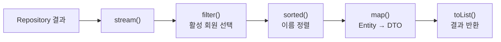

## 1. Stream이란?

Stream은 **컬렉션의 데이터를 선언형 방식으로 처리하기 위한 API**입니다. Java 8에서 도입됐으며 반복 방법보다 무엇을 처리할지에 집중하게 해 줍니다.

기존 반복문은 처리 순서를 직접 작성합니다.

```java
List<String> names = List.of("Kim", "Lee", "Park");

for (String name : names) {
    if (name.startsWith("K")) {
        System.out.println(name);
    }
}
```

Stream에서는 원하는 조건과 결과를 연산으로 표현합니다.

```java
List<String> result = names.stream()
    .filter(name -> name.startsWith("K"))
    .toList();
```

> `Stream.toList()`는 Java 16부터 지원됩니다. Java 8~15에서는 `collect(Collectors.toList())`를 사용합니다.

## 2. Stream의 특징

### 원본 데이터를 변경하지 않는다

```java
List<Integer> numbers = List.of(3, 2, 1);

List<Integer> result = numbers.stream()
    .sorted()
    .toList();

System.out.println(numbers); // [3, 2, 1]
```

Stream은 원본 컬렉션을 변경하지 않고 새로운 결과를 만듭니다.

### 한 번만 사용할 수 있다

```java
Stream<Integer> stream = numbers.stream();

stream.forEach(System.out::println);
stream.forEach(System.out::println); // IllegalStateException
```

최종 연산을 수행한 Stream은 소비된 상태이므로 다시 사용할 수 없습니다.

### 지연 실행한다

중간 연산은 최종 연산이 호출될 때까지 실행되지 않습니다.

```java
numbers.stream()
    .filter(n -> n > 5); // 아직 실행되지 않는다.
```

```java
numbers.stream()
    .filter(n -> n > 5)
    .toList(); // 최종 연산에서 실행된다.
```

## 3. Stream 파이프라인



```java
members.stream()
    .filter(Member::active)
    .map(Member::name)
    .sorted()
    .toList();
```

중간 연산은 Stream을 반환해 연속으로 연결할 수 있고, 최종 연산은 파이프라인을 실행해 결과를 만듭니다.

## 4. Stream 생성

Collection에서는 `stream()`을 사용합니다.

```java
List<String> list = List.of("A", "B", "C");
Stream<String> stream = list.stream();
```

배열은 `Arrays.stream()`으로 변환합니다.

```java
String[] array = {"A", "B", "C"};
Stream<String> stream = Arrays.stream(array);
```

값을 직접 전달할 수도 있습니다.

```java
Stream<Integer> stream = Stream.of(1, 2, 3);
```

## 5. 중간 연산

중간 연산은 Stream을 반환하며 최종 연산이 호출되기 전까지 지연됩니다.

### `filter()`

조건을 만족하는 요소만 통과시킵니다.

```java
numbers.stream()
    .filter(n -> n % 2 == 0);
```



### `map()`

각 요소를 다른 값이나 타입으로 변환합니다.

```java
members.stream()
    .map(Member::name);
```



### `sorted()`

```java
numbers.stream().sorted();
numbers.stream().sorted(Comparator.reverseOrder());

members.stream()
    .sorted(Comparator.comparing(Member::age));
```

### `distinct()`, `limit()`, `skip()`

```java
stream.distinct(); // 중복 제거
stream.limit(5);   // 앞에서 5개 선택
stream.skip(10);   // 앞에서 10개 건너뛰기
```

## 6. 최종 연산

최종 연산이 호출되면 Stream 파이프라인이 실행되고 Stream은 소비됩니다.

### 결과 수집

```java
List<Member> result = members.stream().toList();
```

### 반복 처리와 개수 계산

```java
members.stream().forEach(System.out::println);

long count = members.stream().count();
```

### 요소 검색

```java
Optional<Member> first = members.stream().findFirst();
```

`findFirst()`, `findAny()`, `max()`, `min()`은 값이 없을 수 있으므로 `Optional<T>`를 반환합니다.

### 조건 검사

```java
boolean hasAdult = members.stream()
    .anyMatch(member -> member.age() >= 30);

boolean allActive = members.stream()
    .allMatch(Member::active);

boolean noMinor = members.stream()
    .noneMatch(member -> member.age() < 20);
```

## 7. Collectors

`collect()`는 Stream의 요소를 List, Map, 그룹 등의 가변 결과 컨테이너로 수집합니다.

### `toMap()`

```java
Map<Long, Member> memberMap = members.stream()
    .collect(Collectors.toMap(
        Member::id,
        Function.identity()
    ));
```

키가 중복될 가능성이 있다면 병합 함수를 명시해야 합니다.

```java
Map<String, Member> memberMap = members.stream()
    .collect(Collectors.toMap(
        Member::name,
        Function.identity(),
        (existing, replacement) -> existing
    ));
```

### `groupingBy()`

```java
Map<Integer, List<Member>> membersByAge = members.stream()
    .collect(Collectors.groupingBy(Member::age));
```



### `partitioningBy()`

조건 결과가 `true`와 `false`인 두 그룹으로 분리합니다.

```java
Map<Boolean, List<Member>> partitioned = members.stream()
    .collect(Collectors.partitioningBy(Member::active));
```

### `joining()`

```java
String names = members.stream()
    .map(Member::name)
    .collect(Collectors.joining(", "));
```

결과는 `Kim, Lee, Park`와 같은 하나의 문자열입니다.

## 8. `reduce()`

`reduce()`는 여러 요소를 하나의 값으로 축약합니다.

```java
int sum = numbers.stream()
    .reduce(0, Integer::sum);
```

```java
int max = numbers.stream()
    .reduce(Integer.MIN_VALUE, Math::max);
```

```java
String names = members.stream()
    .map(Member::name)
    .reduce("", (a, b) -> a.isEmpty() ? b : a + ", " + b);
```

합계, 평균, 최댓값, 최솟값은 기본형 특화 Stream을 사용하면 더 간결하고 boxing 비용도 줄일 수 있습니다.

```java
int sum = members.stream()
    .mapToInt(Member::age)
    .sum();

OptionalDouble average = members.stream()
    .mapToInt(Member::age)
    .average();
```

## 9. 타입 흐름 이해하기

```java
List<String> activeMemberNames = members.stream()
    .filter(Member::active)
    .map(Member::name)
    .toList();
```



`filter()`는 요소의 타입을 유지하고 `map()`은 요소의 타입을 변경할 수 있습니다.

## 10. 실무에서 자주 사용하는 패턴

### Entity를 DTO로 변환

```java
return memberRepository.findAll().stream()
    .filter(Member::active)
    .map(MemberResponse::from)
    .toList();
```

### List를 Map으로 변환

```java
Map<Long, Member> memberMap = members.stream()
    .collect(Collectors.toMap(
        Member::id,
        Function.identity()
    ));
```

### 기준별 그룹 생성

```java
Map<Integer, List<Member>> membersByAge = members.stream()
    .collect(Collectors.groupingBy(Member::age));
```

### 존재 여부 확인

```java
boolean exists = members.stream()
    .anyMatch(member -> member.age() >= 30);
```

## 11. Stream 사용 시 주의사항

### 복잡한 비즈니스 규칙을 람다에 숨기지 않는다

다음 코드는 조건의 의미를 파악하기 어렵습니다.

```java
.filter(member ->
    member.getPoint() > 1000 &&
    member.getOrders().size() > 10 &&
    member.getStatus() == Status.ACTIVE
)
```

DDD에서는 규칙을 도메인 객체의 이름 있는 메서드로 옮기는 편이 좋습니다.

```java
.filter(Member::isLoyalCustomer)
```

### 부수 효과를 피한다

`map()`이나 `filter()` 안에서 외부 상태를 변경하면 파이프라인을 이해하기 어렵고 병렬 처리에서도 문제가 될 수 있습니다. Stream 연산은 가능한 한 순수 함수로 구성합니다.

### 무조건 반복문을 대체하지 않는다

분기와 상태 변경이 많은 복잡한 처리에서는 일반 반복문이 더 읽기 쉬울 수 있습니다. Stream은 변환·필터·집계 파이프라인이 명확할 때 사용합니다.

## 12. 주요 메서드 사용 빈도

| 메서드 | 사용 빈도 |
| --- | --- |
| `filter()` | ⭐⭐⭐⭐⭐ |
| `map()` | ⭐⭐⭐⭐⭐ |
| `toList()` | ⭐⭐⭐⭐⭐ |
| `findFirst()` | ⭐⭐⭐⭐⭐ |
| `anyMatch()` | ⭐⭐⭐⭐⭐ |
| `sorted()` | ⭐⭐⭐⭐☆ |
| `Collectors.toMap()` | ⭐⭐⭐⭐☆ |
| `Collectors.groupingBy()` | ⭐⭐⭐⭐☆ |
| `Collectors.partitioningBy()` | ⭐⭐⭐☆☆ |
| `reduce()` | ⭐⭐☆☆☆ |

## 13. Spring과 DDD에서 자주 보는 코드

```java
public List<MemberResponse> getActiveMembers() {
    return memberRepository.findAll().stream()
        .filter(Member::active)
        .sorted(Comparator.comparing(Member::name))
        .map(MemberResponse::from)
        .toList();
}
```



이 흐름에는 Stream의 핵심인 생성, 선택, 정렬, 변환, 수집이 모두 포함돼 있습니다.

## Optional과의 관계

Stream과 Optional은 서로 다른 API지만 일부 최종 연산은 결과가 없을 가능성을 표현하기 위해 Optional을 반환합니다.

```java
members.stream().findFirst(); // Optional<Member>
members.stream().findAny();   // Optional<Member>
members.stream().max(...);    // Optional<Member>
members.stream().min(...);    // Optional<Member>
```

Optional의 생성과 `orElse()`, `orElseThrow()`, `ifPresent()`, `map()`은 별도 주제로 나누어 학습하는 편이 명확합니다.

## 핵심 정리

- Stream은 원본 컬렉션을 변경하지 않습니다.
- Stream은 최종 연산 후 재사용할 수 없습니다.
- 중간 연산은 지연되며 최종 연산에서 실행됩니다.
- `filter()`는 요소를 선택하고 `map()`은 값과 타입을 변환합니다.
- 복잡한 비즈니스 규칙과 부수 효과를 람다에 숨기지 않습니다.

Stream의 핵심은 반복문을 짧게 쓰는 것이 아니라 **데이터 처리 과정을 읽을 수 있는 파이프라인으로 표현하는 것**입니다.
