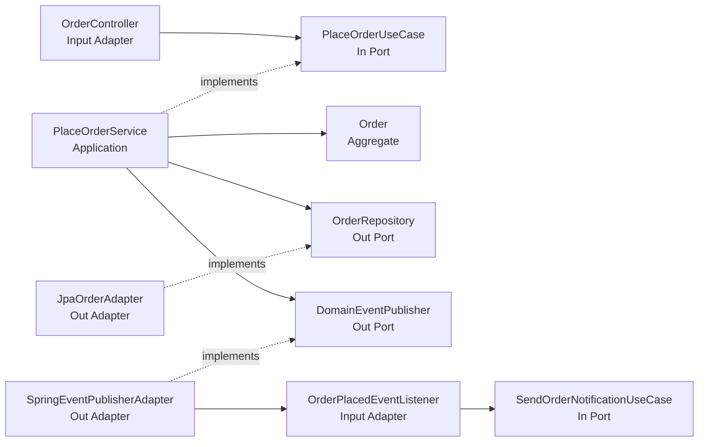
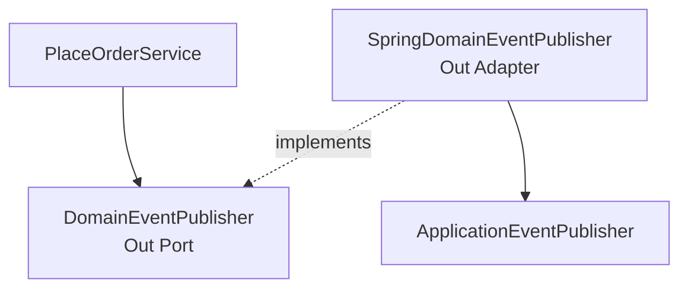
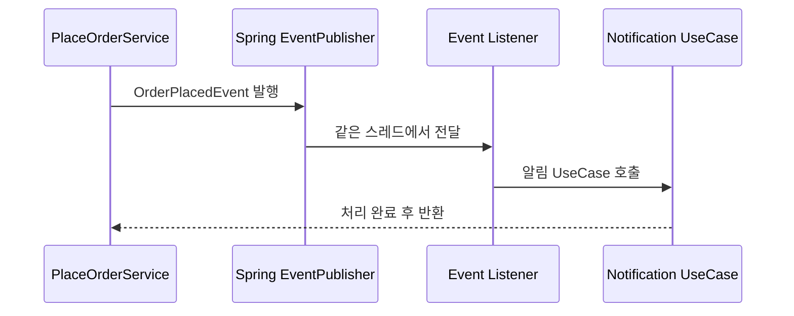
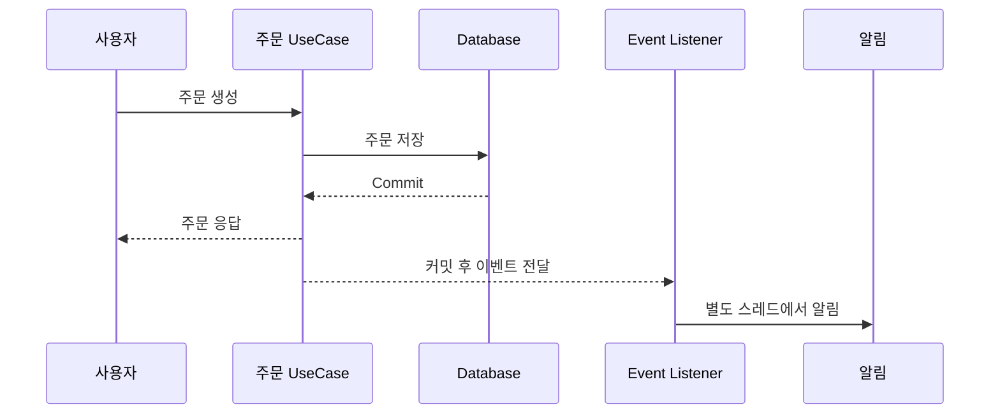
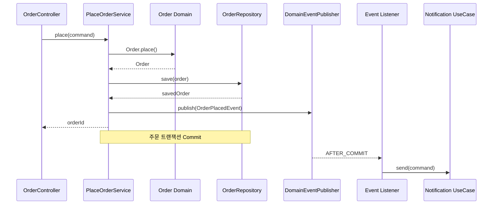
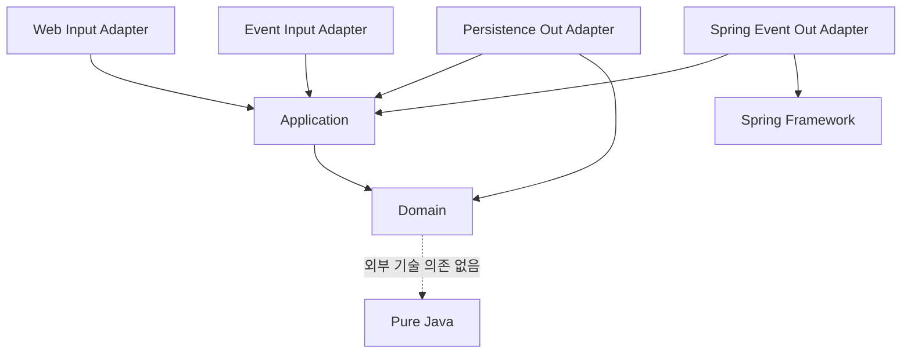
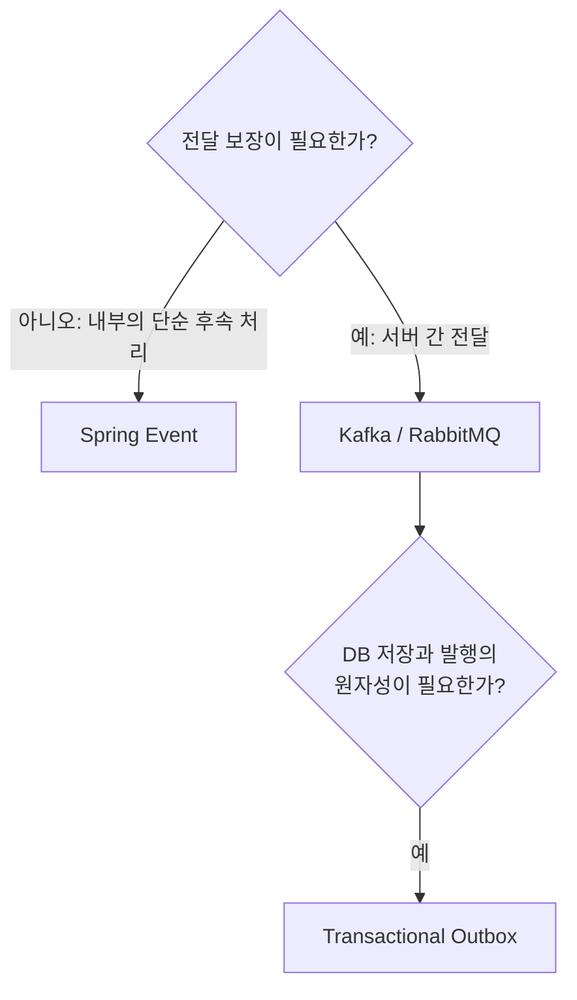

주문이 생성되면 저장 트랜잭션을 완료한 뒤 알림을 보내는 상황을 Spring Boot, DDD, 헥사고날 아키텍처로 구성해 보겠습니다.



## 1. 프로젝트 구성

Spring Initializr에서 Spring Web, Spring Data JPA, Validation, H2 Database를 선택합니다. Spring 이벤트는 Framework의 Application Context 기능이므로 별도 starter가 필요하지 않습니다.

```groovy
plugins {
    id 'java'
    id 'org.springframework.boot' version '현재 사용하는 Spring Boot 버전'
    id 'io.spring.dependency-management' version '현재 사용하는 버전'
}

java {
    toolchain {
        languageVersion = JavaLanguageVersion.of(21)
    }
}

repositories {
    mavenCentral()
}

dependencies {
    implementation 'org.springframework.boot:spring-boot-starter-web'
    implementation 'org.springframework.boot:spring-boot-starter-data-jpa'
    implementation 'org.springframework.boot:spring-boot-starter-validation'
    runtimeOnly 'com.h2database:h2'
    testImplementation 'org.springframework.boot:spring-boot-starter-test'
}

tasks.named('test') {
    useJUnitPlatform()
}
```

## 2. 패키지 구조

```text
order
├── domain
│   ├── model
│   │   ├── Order.java
│   │   └── OrderStatus.java
│   └── event
│       └── OrderPlacedEvent.java
├── application
│   ├── port
│   │   ├── in
│   │   │   ├── PlaceOrderUseCase.java
│   │   │   └── SendOrderNotificationUseCase.java
│   │   └── out
│   │       ├── OrderRepository.java
│   │       ├── DomainEventPublisher.java
│   │       └── NotificationPort.java
│   └── service
│       ├── PlaceOrderService.java
│       └── SendOrderNotificationService.java
├── adapter
│   ├── in
│   │   ├── web/OrderController.java
│   │   └── event/OrderPlacedEventListener.java
│   └── out
│       ├── persistence/JpaOrderAdapter.java
│       ├── event/SpringDomainEventPublisher.java
│       └── notification/ConsoleNotificationAdapter.java
└── infrastructure
    └── config/AsyncConfig.java
```

핵심 의존성 규칙은 다음과 같습니다.

- Domain은 Spring을 모릅니다.
- Application은 `ApplicationEventPublisher`를 모릅니다.
- Adapter와 Infrastructure가 Spring 기술을 사용합니다.

## 3. 도메인 이벤트 정의

도메인 이벤트는 도메인에서 이미 발생한 과거의 사실입니다.

```java
package com.example.order.domain.event;

import java.time.LocalDateTime;

public record OrderPlacedEvent(
    Long orderId,
    Long memberId,
    long totalAmount,
    LocalDateTime occurredAt
) {
}
```

`PlaceOrder`는 명령이고 `OrderPlacedEvent`는 이미 발생한 사실입니다. 이벤트 객체는 `@Component`, `@EventListener`, `ApplicationEventPublisher` 같은 Spring 코드를 포함하지 않는 순수 Java 객체입니다.

## 4. Aggregate 구현

```java
package com.example.order.domain.model;

public class Order {
    private final Long id;
    private final Long memberId;
    private final long totalAmount;
    private OrderStatus status;

    private Order(Long id, Long memberId, long totalAmount, OrderStatus status) {
        this.id = id;
        this.memberId = memberId;
        this.totalAmount = totalAmount;
        this.status = status;
    }

    public static Order place(Long id, Long memberId, long totalAmount) {
        if (memberId == null) {
            throw new IllegalArgumentException("회원 ID는 필수입니다.");
        }
        if (totalAmount <= 0) {
            throw new IllegalArgumentException("주문 금액은 0보다 커야 합니다.");
        }
        return new Order(id, memberId, totalAmount, OrderStatus.PLACED);
    }

    public Long getId() { return id; }
    public Long getMemberId() { return memberId; }
    public long getTotalAmount() { return totalAmount; }
    public OrderStatus getStatus() { return status; }
}
```

```java
public enum OrderStatus {
    PLACED,
    CANCELLED
}
```

Domain은 회원 ID가 필요하고 주문 금액이 양수여야 하며 생성 상태가 `PLACED`라는 규칙만 담당합니다. 이벤트를 어떤 기술로 전달하는지는 알지 못합니다.

## 5. In Port와 Out Port

Controller가 호출할 주문 생성 In Port입니다.

```java
public interface PlaceOrderUseCase {
    PlaceOrderResult place(PlaceOrderCommand command);

    record PlaceOrderCommand(Long memberId, long totalAmount) {}
    record PlaceOrderResult(Long orderId) {}
}
```

Application이 사용하는 저장소와 이벤트 발행 Out Port입니다.

```java
public interface OrderRepository {
    Order save(Order order);
}
```

```java
public interface DomainEventPublisher {
    void publish(Object event);
}
```

Application은 저장소가 JPA인지 MyBatis인지, 이벤트가 Spring Event인지 Kafka인지 모릅니다.

## 6. 주문 Application Service

```java
@Service
public class PlaceOrderService implements PlaceOrderUseCase {
    private final OrderRepository orderRepository;
    private final DomainEventPublisher eventPublisher;
    private final AtomicLong sequence = new AtomicLong();

    public PlaceOrderService(
        OrderRepository orderRepository,
        DomainEventPublisher eventPublisher
    ) {
        this.orderRepository = orderRepository;
        this.eventPublisher = eventPublisher;
    }

    @Override
    @Transactional
    public PlaceOrderResult place(PlaceOrderCommand command) {
        Long orderId = sequence.incrementAndGet();
        Order order = Order.place(
            orderId, command.memberId(), command.totalAmount()
        );
        Order savedOrder = orderRepository.save(order);

        eventPublisher.publish(new OrderPlacedEvent(
            savedOrder.getId(),
            savedOrder.getMemberId(),
            savedOrder.getTotalAmount(),
            LocalDateTime.now()
        ));

        return new PlaceOrderResult(savedOrder.getId());
    }
}
```

Application Service는 주문 생성, 저장, 이벤트 발행, 결과 반환의 순서를 조율합니다. 실제 도메인 규칙은 `Order.place()`가 수행합니다. `AtomicLong`은 흐름을 단순화한 예시이며 실제 시스템에서는 DB나 별도 ID 생성 전략을 사용해야 합니다.

## 7. Spring 이벤트 Out Adapter

```java
@Component
public class SpringDomainEventPublisher
        implements DomainEventPublisher {
    private final ApplicationEventPublisher publisher;

    public SpringDomainEventPublisher(
        ApplicationEventPublisher publisher
    ) {
        this.publisher = publisher;
    }

    @Override
    public void publish(Object event) {
        publisher.publishEvent(event);
    }
}
```



Spring은 `ApplicationEvent`를 상속하지 않은 일반 객체도 이벤트로 발행할 수 있습니다. 기본 이벤트 전달은 호출 스레드에서 동기적으로 수행됩니다.

## 8. Controller는 Input Adapter다

```java
@RestController
@RequestMapping("/orders")
public class OrderController {
    private final PlaceOrderUseCase placeOrderUseCase;

    public OrderController(PlaceOrderUseCase placeOrderUseCase) {
        this.placeOrderUseCase = placeOrderUseCase;
    }

    @PostMapping
    @ResponseStatus(HttpStatus.CREATED)
    public PlaceOrderResponse place(
        @Valid @RequestBody PlaceOrderRequest request
    ) {
        PlaceOrderUseCase.PlaceOrderResult result =
            placeOrderUseCase.place(
                new PlaceOrderUseCase.PlaceOrderCommand(
                    request.memberId(), request.totalAmount()
                )
            );
        return new PlaceOrderResponse(result.orderId());
    }

    public record PlaceOrderRequest(
        @NotNull Long memberId,
        @Positive long totalAmount
    ) {}

    public record PlaceOrderResponse(Long orderId) {}
}
```

HTTP Controller, Kafka Consumer, Spring Event Listener, Batch Job은 모두 외부 입력을 받아 Application의 In Port를 호출하는 Input Adapter로 볼 수 있습니다.

## 9. 알림 UseCase와 Out Port

```java
public interface SendOrderNotificationUseCase {
    void send(SendOrderNotificationCommand command);

    record SendOrderNotificationCommand(
        Long orderId,
        Long memberId
    ) {}
}
```

```java
public interface NotificationPort {
    void sendOrderPlaced(Long orderId, Long memberId);
}
```

```java
@Service
public class SendOrderNotificationService
        implements SendOrderNotificationUseCase {
    private final NotificationPort notificationPort;

    public SendOrderNotificationService(NotificationPort notificationPort) {
        this.notificationPort = notificationPort;
    }

    @Override
    public void send(SendOrderNotificationCommand command) {
        notificationPort.sendOrderPlaced(
            command.orderId(), command.memberId()
        );
    }
}
```

Application은 알림이 콘솔, 이메일, SMS, 카카오 알림 중 무엇인지 알 필요가 없습니다.

## 10. `@EventListener`의 동기 실행

```java
@Component
public class OrderPlacedEventListener {
    private final SendOrderNotificationUseCase notificationUseCase;

    public OrderPlacedEventListener(
        SendOrderNotificationUseCase notificationUseCase
    ) {
        this.notificationUseCase = notificationUseCase;
    }

    @EventListener
    public void handle(OrderPlacedEvent event) {
        notificationUseCase.send(
            new SendOrderNotificationUseCase.SendOrderNotificationCommand(
                event.orderId(), event.memberId()
            )
        );
    }
}
```



기본 Spring 이벤트는 동기 실행입니다. Listener의 예외가 이벤트를 발행한 호출 흐름과 트랜잭션에 영향을 줄 수 있습니다.

## 11. `@TransactionalEventListener`와 AFTER_COMMIT

주문 저장이 롤백됐는데 알림만 발송되는 문제를 막으려면 트랜잭션이 성공적으로 커밋된 뒤 Listener를 실행해야 합니다.

```java
@TransactionalEventListener(
    phase = TransactionPhase.AFTER_COMMIT
)
public void handle(OrderPlacedEvent event) {
    notificationUseCase.send(
        new SendOrderNotificationUseCase.SendOrderNotificationCommand(
            event.orderId(), event.memberId()
        )
    );
}
```

`@TransactionalEventListener`의 기본 단계는 `AFTER_COMMIT`입니다. 트랜잭션이 없다면 기본적으로 Listener는 실행되지 않으며 필요할 때만 `fallbackExecution = true`를 고려합니다.

| Phase | 실행 시점 | 대표 용도 |
| --- | --- | --- |
| `BEFORE_COMMIT` | 커밋 직전 | 커밋 전 필수 작업 |
| `AFTER_COMMIT` | 커밋 성공 후 | 알림, 후속 처리 |
| `AFTER_ROLLBACK` | 롤백 후 | 실패 기록, 보상 처리 시작 |
| `AFTER_COMPLETION` | 성공·실패와 관계없이 완료 후 | 리소스 정리 |

## 12. AFTER_COMMIT 이후 DB 작업

`AFTER_COMMIT` 시점에는 원래 주문 트랜잭션이 끝났습니다. Listener가 호출하는 UseCase에서 알림 이력처럼 새로운 데이터를 저장하려면 별도 트랜잭션을 명확히 시작하는 것이 안전합니다.

```java
@Service
public class SendOrderNotificationService
        implements SendOrderNotificationUseCase {

    @Override
    @Transactional(propagation = Propagation.REQUIRES_NEW)
    public void send(SendOrderNotificationCommand command) {
        notificationPort.sendOrderPlaced(
            command.orderId(), command.memberId()
        );
        historyPort.save(command.orderId(), "SENT");
    }
}
```

Spring의 프록시 기반 트랜잭션은 외부에서 프록시를 통해 호출될 때 적용됩니다. 같은 객체 내부의 자기 호출에는 기본적으로 적용되지 않는다는 점도 주의해야 합니다.

## 13. 비동기 이벤트 처리

알림 전송이 오래 걸리면 주문 응답이 알림 완료를 기다리지 않도록 별도 스레드에서 처리할 수 있습니다.

```java
@Configuration
@EnableAsync
public class AsyncConfig {

    @Bean(name = "eventExecutor")
    public Executor eventExecutor() {
        ThreadPoolTaskExecutor executor = new ThreadPoolTaskExecutor();
        executor.setCorePoolSize(2);
        executor.setMaxPoolSize(5);
        executor.setQueueCapacity(100);
        executor.setThreadNamePrefix("domain-event-");
        executor.initialize();
        return executor;
    }
}
```

```java
@Async("eventExecutor")
@TransactionalEventListener(
    phase = TransactionPhase.AFTER_COMMIT
)
public void handle(OrderPlacedEvent event) {
    notificationUseCase.send(
        new SendOrderNotificationUseCase.SendOrderNotificationCommand(
            event.orderId(), event.memberId()
        )
    );
}
```



비동기 Listener의 예외는 원래 발행자에게 전달되지 않습니다. MDC와 같은 ThreadLocal 기반 로깅 컨텍스트도 자동 전파되지 않을 수 있으므로 실행기 설정과 오류 관찰 전략이 필요합니다.

## 14. Notification Out Adapter

```java
@Component
public class ConsoleNotificationAdapter
        implements NotificationPort {
    @Override
    public void sendOrderPlaced(Long orderId, Long memberId) {
        System.out.printf(
            "회원 %d에게 주문 %d 생성 알림 발송%n",
            memberId, orderId
        );
    }
}
```

나중에 이 Adapter만 `EmailNotificationAdapter`, `KakaoNotificationAdapter`, `SmsNotificationAdapter`로 교체할 수 있으며 Application 코드는 바뀌지 않습니다.

## 15. 전체 실행 흐름





## 16. 단위 테스트

Application Service가 Spring 대신 직접 정의한 Port에 의존하므로 Spring Context 없이 테스트할 수 있습니다.

```java
class FakeDomainEventPublisher implements DomainEventPublisher {
    private final List<Object> events = new ArrayList<>();

    @Override
    public void publish(Object event) {
        events.add(event);
    }

    public List<Object> events() {
        return List.copyOf(events);
    }
}
```

```java
class PlaceOrderServiceTest {
    @Test
    void 주문을_생성하면_이벤트를_발행한다() {
        FakeOrderRepository repository = new FakeOrderRepository();
        FakeDomainEventPublisher publisher =
            new FakeDomainEventPublisher();
        PlaceOrderService service =
            new PlaceOrderService(repository, publisher);

        PlaceOrderUseCase.PlaceOrderResult result = service.place(
            new PlaceOrderUseCase.PlaceOrderCommand(10L, 50_000L)
        );

        assertThat(result.orderId()).isNotNull();
        assertThat(publisher.events())
            .hasSize(1)
            .first()
            .isInstanceOf(OrderPlacedEvent.class);
    }
}
```

## 17. 어떤 Listener를 선택할까?

| 기준 | `@EventListener` | `@TransactionalEventListener` |
| --- | --- | --- |
| 기본 실행 | 즉시, 동기 | 지정한 트랜잭션 단계 |
| 커밋 성공 보장 | 없음 | `AFTER_COMMIT` 사용 가능 |
| 적합한 작업 | 같은 흐름의 단순 후속 작업 | 커밋 후 알림·캐시·외부 호출 |
| 주의점 | Listener 실패가 원 작업에 영향 | 새 DB 작업에는 새 트랜잭션 고려 |

저장 성공 후 수행해야 하는 부가 기능에는 `AFTER_COMMIT`이 더 자연스럽습니다.

## 18. Spring 이벤트의 한계와 Outbox

Spring Application Event는 같은 애플리케이션 프로세스 내부에서 동작하며 기본적으로 동기·메모리 기반입니다. 별도 영속화가 없기 때문에 비동기 Listener 실행 중 프로세스가 종료되거나 처리에 실패하면 이벤트를 잃을 수 있습니다.



- 같은 서버 내부의 단순 후속 처리: Spring Event
- 다른 서버에 반드시 전달: Kafka, RabbitMQ 같은 메시지 브로커
- DB 저장과 메시지 발행의 원자성 필요: Transactional Outbox Pattern

Spring 이벤트를 메시지 브로커의 대체물로 생각해서는 안 됩니다.

## 핵심 정리

> Domain Event는 도메인에서 발생한 사실이고, Application은 이벤트 발행을 요청하며, Spring Adapter가 실제 전달을 담당하고, Event Listener는 다시 Application의 In Port를 호출합니다.

처음 적용할 때는 주문 처리 메서드에 `@Transactional`을 적용하고, 후속 작업은 `@TransactionalEventListener(phase = AFTER_COMMIT)`에서 별도 UseCase로 위임하는 구조로 시작할 수 있습니다. 처리 유실을 허용할 수 없는 서버 간 이벤트라면 Spring Event에서 끝내지 말고 Outbox와 메시지 브로커로 확장해야 합니다.
