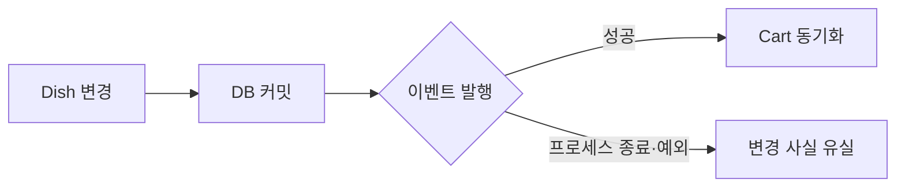
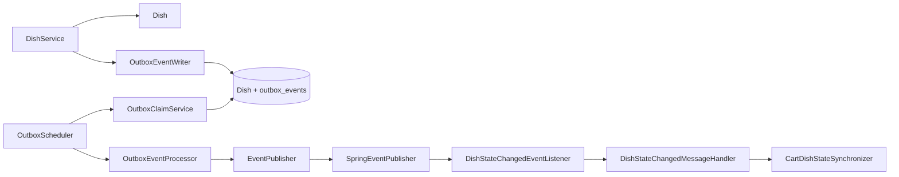
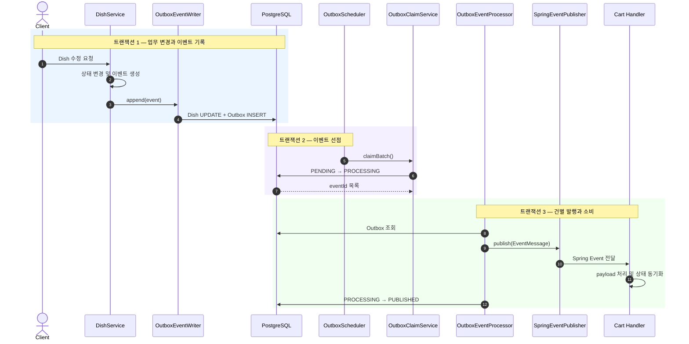
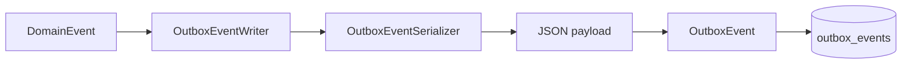
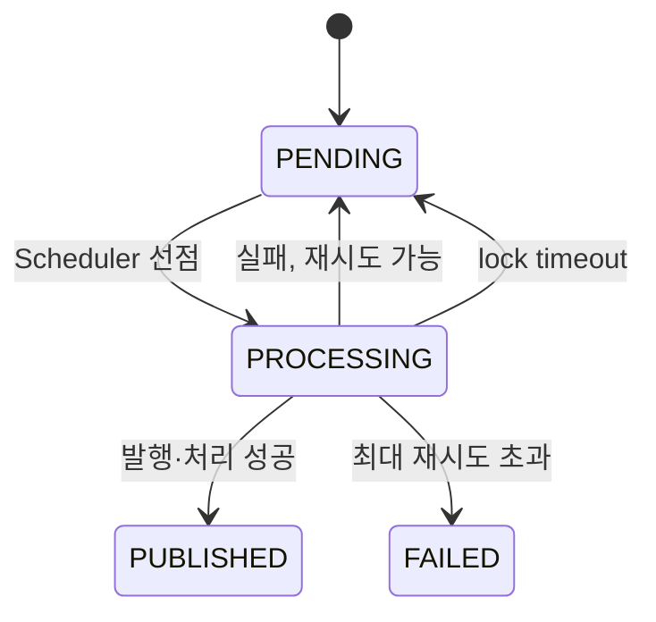
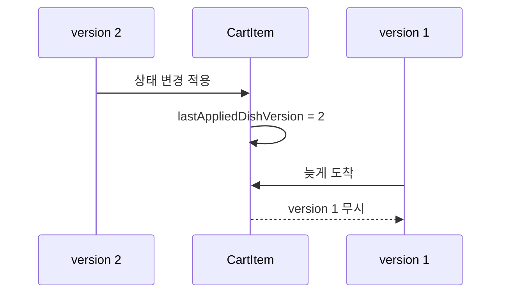
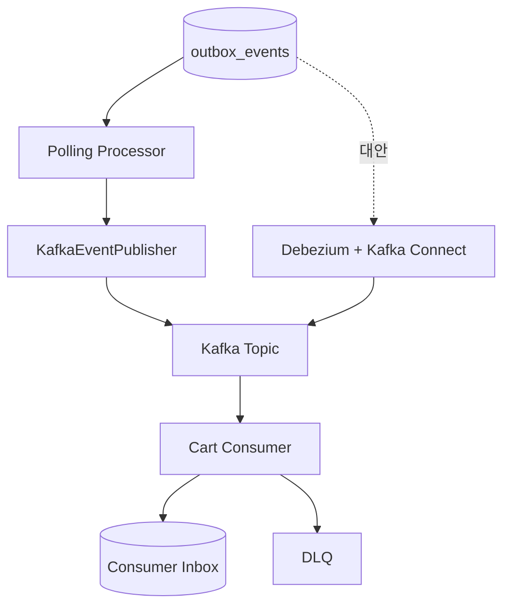

서비스 내부에서 도메인 변경을 다른 기능에 전달할 때 단순히 Spring Event를 발행하면 DB 커밋과 이벤트 전달 사이에 빈틈이 생깁니다. 이번 프로젝트에서는 Dish의 판매 상태와 재고 변경을 Cart에 반영해야 했고, 변경 사실이 유실되지 않도록 **Polling Outbox 패턴**을 적용했습니다.

현재 구현은 Kafka가 아닌 Spring Event를 발행 어댑터로 사용합니다. 핵심은 메시지 브로커의 종류가 아니라 **업무 데이터 변경과 이벤트 기록을 같은 DB 트랜잭션에 저장하는 것**입니다.

## Outbox가 필요했던 이유

다음처럼 업무 데이터를 저장한 뒤 이벤트를 직접 발행하면 두 작업은 하나의 원자적 연산이 아닙니다.

```java
@Transactional
public void updateDish(Long dishId, DishUpdateCommand command) {
    Dish dish = dishRepository.findById(dishId).orElseThrow();
    dish.update(command);

    applicationEventPublisher.publishEvent(event);
}
```

DB 커밋은 성공했지만 이벤트 발행 전에 애플리케이션이 종료되면 Dish는 변경되고 Cart는 이전 상태에 머물 수 있습니다. 반대로 이벤트를 먼저 처리한 뒤 DB 트랜잭션이 롤백되는 문제도 생길 수 있습니다.



Outbox는 이벤트를 바로 외부로 보내지 않고 업무 변경과 함께 DB에 기록합니다.

```text
Dish 변경 성공 + Outbox 저장 성공 → 함께 커밋
Dish 변경 성공 + Outbox 저장 실패 → 함께 롤백
```

따라서 “Dish는 바뀌었지만 변경 이벤트는 존재하지 않는 상태”를 방지할 수 있습니다.

## 현재 구현 구조

이번 구현은 **Spring Event를 발행 어댑터로 사용하는 Polling Outbox**입니다.



설계할 때 다음 원칙을 지켰습니다.

- Dish 변경과 Outbox 저장은 같은 트랜잭션에서 처리합니다.
- Outbox 공통 계층은 구체적인 Dish 이벤트 클래스를 알지 못합니다.
- Processor는 Outbox 레코드를 기술 중립적인 `EventMessage`로 변환합니다.
- Consumer인 Cart가 payload 타입과 역직렬화 책임을 가집니다.
- 전달 방식은 최소 한 번(at-least-once)을 목표로 합니다.
- 중복 또는 늦게 도착한 상태 이벤트는 `aggregateVersion`으로 거부합니다.

## 전체 실행 순서와 트랜잭션 경계

전체 처리는 세 개의 트랜잭션 경계로 분리했습니다.



선점과 실제 처리를 나눈 이유는 DB 잠금을 Listener 처리 시간까지 유지하지 않기 위해서입니다. 먼저 짧은 트랜잭션으로 처리할 이벤트의 UUID만 확보하고, 각 이벤트는 독립된 `REQUIRES_NEW` 트랜잭션에서 처리합니다. 한 건이 실패해도 같은 배치의 나머지 이벤트는 계속 처리할 수 있습니다.

## 도메인 변경과 이벤트 생성

Dish의 판매 여부뿐 아니라 재고 수량도 Cart에 전달합니다. CartItem 수량이 7개이고 Dish 재고가 5개라면 Dish가 판매 중이어도 해당 항목은 `INSUFFICIENT_STOCK`이어야 하기 때문입니다.

```java
public record DishStateChangedEvent(
    UUID eventId,
    int schemaVersion,
    Long dishId,
    boolean available,
    Long stockQuantity,
    Instant occurredAt
) implements DomainEvent {
}
```

이벤트에는 업무 payload 외에도 다음 메타데이터가 필요합니다.

| 값 | 역할 |
| --- | --- |
| `eventId` | 재시도와 중복 전달 식별 |
| `schemaVersion` | 이벤트 계약 버전 관리 |
| `eventType` | Java 클래스명과 독립적인 이벤트 식별 |
| `aggregateType` | 이벤트가 발생한 도메인 식별 |
| `aggregateId` | 이벤트가 발생한 Aggregate 식별 |
| `aggregateVersion` | 같은 Aggregate의 변경 순서 판별 |
| `occurredAt` | 사건이 발생한 시각 |

이벤트는 상태가 실제로 바뀐 경우에만 생성하며, 업무 변경 메서드의 `@Transactional` 범위 안에서 Outbox에 기록합니다.

```java
long aggregateVersion = dish.nextEventVersion();

outboxEventWriter.append(
    DishStateChangedEvent.from(dish, aggregateVersion)
);
```

Producer에서 `ApplicationEventPublisher`를 직접 호출하지 않는 것이 중요합니다.

## Outbox 저장 계층

`OutboxEventWriter`는 도메인 이벤트를 JSON으로 직렬화하고 `outbox_events` 테이블에 `PENDING` 상태로 저장합니다.



주요 저장 값은 다음과 같습니다.

| 컬럼 | 의미 |
| --- | --- |
| `event_id` | 재시도해도 유지되는 이벤트 ID |
| `event_type` | `DISH_STATE_CHANGED` 같은 계약 이름 |
| `aggregate_type`, `aggregate_id` | 이벤트 발생 대상 |
| `aggregate_version` | 동일 Aggregate의 변경 버전 |
| `payload` | 이벤트를 직렬화한 JSON |
| `status` | `PENDING`, `PROCESSING`, `PUBLISHED`, `FAILED` |
| `retry_count` | 처리 실패 횟수 |
| `occurred_at`, `published_at` | 발생·발행 시각 |
| `last_error` | 마지막 실패 원인 |

공통 계층은 JSON을 다시 `DishStateChangedEvent`로 복원하지 않습니다. 도메인별 Resolver를 두지 않고 메타데이터와 payload만 운반하므로 Outbox가 Dish, Cart, Order 같은 개별 도메인에 의존하지 않습니다.

## Scheduler와 이벤트 선점

Scheduler는 고정 지연 방식으로 실행되며 한 번에 최대 100건을 선점합니다.

```yaml
outbox:
  scheduler:
    enabled: true
  polling-delay-ms: 1000
  batch-size: 100
  max-retries: 5
  lock-timeout-seconds: 60
```

선점 쿼리의 핵심 조건은 다음과 같습니다.

```sql
WHERE status = 'PENDING'
   OR (status = 'PROCESSING' AND locked_at < :lockExpiredBefore)
ORDER BY occurred_at
LIMIT :batchSize
FOR UPDATE SKIP LOCKED
```

- `PENDING` 이벤트와 잠금 시간이 만료된 `PROCESSING` 이벤트를 찾습니다.
- `FOR UPDATE SKIP LOCKED`로 여러 인스턴스가 같은 행을 동시에 기다리지 않게 합니다.
- 후보 선택과 `PROCESSING` 전환을 하나의 트랜잭션에서 수행합니다.
- 애플리케이션이 처리 중 종료돼도 lock timeout 이후 다시 선점할 수 있습니다.

`ORDER BY occurred_at`은 **선점 순서**만 정합니다. 여러 인스턴스와 재시도가 섞이면 실제 완료 순서까지 보장하지는 않습니다.

## 기술 중립적인 EventMessage

Outbox Processor와 발행 어댑터 사이에는 `EventMessage`를 사용합니다.

```java
public record EventMessage(
    UUID eventId,
    String eventType,
    String aggregateType,
    Long aggregateId,
    long aggregateVersion,
    String payload,
    Instant occurredAt
) {
}
```

```java
public interface EventPublisher {
    void publish(EventMessage message);
}
```

현재 구현체는 `EventMessage` 자체를 Spring Event로 발행합니다.

```java
@Override
public void publish(EventMessage message) {
    applicationEventPublisher.publishEvent(message);
}
```

`publish()`가 정상 반환하면 성공, 예외가 발생하면 실패로 판단합니다. 구현체가 예외를 삼키면 Outbox가 실패를 감지할 수 없으므로 발행 실패는 반드시 호출자에게 전달해야 합니다.

## Consumer가 payload를 소유하게 한 이유

Cart의 Listener는 이벤트 타입을 확인하고 Handler에 위임하는 역할만 가집니다.

```java
@EventListener
public void handle(EventMessage message) {
    if (!EVENT_TYPE.equals(message.eventType())) {
        return;
    }

    handler.handle(message);
}
```

Handler는 Cart가 소유한 payload로 JSON을 역직렬화한 뒤 상태 동기화 로직을 호출합니다.

```java
public record DishStateChangedPayload(
    Long dishId,
    boolean available,
    Long stockQuantity
) {
}
```

이렇게 하면 Cart가 Producer의 Java 이벤트 클래스를 직접 import하지 않습니다. Producer와 Consumer는 클래스가 아닌 `eventType`, schema, JSON payload 계약으로 연결됩니다.

## 실패 기록과 재시도

Spring Event 자체가 재시도를 제공하는 것은 아닙니다. Outbox 상태와 Scheduler가 재시도를 담당합니다.



처리 트랜잭션 안에서 실패 횟수를 저장하면 예외 롤백과 함께 기록도 사라집니다. 따라서 `OutboxFailureRecorder`는 별도의 `REQUIRES_NEW` 트랜잭션으로 `retryCount`와 `lastError`를 저장합니다.

현재 최대 재시도 횟수는 5회입니다.

```text
1~4차 실패 → retryCount 증가, PENDING 복귀
5차 실패   → retryCount 5, FAILED 전환
```

`FAILED` 이벤트는 자동 처리 대상에서 제외되며 운영 확인 또는 수동 복구가 필요합니다. 현재는 실패한 오래된 이벤트가 다음 Polling에서도 먼저 선택될 수 있으므로, 이후 `nextRetryAt`과 지수 백오프를 추가할 수 있습니다.

## 최소 한 번 전달과 멱등성

Cart 처리는 성공했지만 Outbox를 `PUBLISHED`로 커밋하기 직전에 프로세스가 종료될 수 있습니다. 이 이벤트는 lock timeout 후 다시 발행될 수 있으므로 현재 구조는 정확히 한 번이 아니라 **최소 한 번 전달**을 목표로 합니다.

상태를 최신 값으로 덮어쓰는 작업은 비교적 멱등적으로 만들 수 있지만, 다음 작업은 중복 실행되면 안 됩니다.

- 포인트 차감 또는 적립
- 재고 수량 증감
- 결제 승인과 취소
- 알림 발송

이런 Consumer에는 `eventId`에 Unique 제약을 둔 Inbox 또는 업무 거래 ID 기반의 멱등 처리가 필요합니다. 현재 프로젝트에는 Consumer Inbox가 아직 구현되지 않았습니다.

## aggregateVersion으로 오래된 상태 거부하기

선점 순서만으로 동일 Dish 이벤트의 처리 완료 순서를 보장할 수 없으므로 CartItem에 마지막 적용 버전을 저장했습니다.

```java
if (aggregateVersion <= this.lastAppliedDishVersion) {
    return;
}
```



이 방식은 상태 동기화에는 적합하지만 누적 연산의 중복 방지까지 해결하지는 않습니다. 버전 검증과 Inbox는 서로 다른 문제를 해결합니다.

## API 통합 테스트로 확인한 흐름

Local Docker Compose 환경에서 실제 API와 PostgreSQL 데이터를 함께 확인했습니다.

1. 회원과 판매자를 생성하고 로그인합니다.
2. 판매자의 Store와 재고 10인 Dish를 생성합니다.
3. 회원 Cart에 Dish 5개를 담아 `AVAILABLE`을 확인합니다.
4. Dish 재고를 3으로 변경합니다.
5. CartItem이 `INSUFFICIENT_STOCK`으로 바뀌는지 확인합니다.
6. Outbox가 `PUBLISHED`, `retry_count = 0`인지 확인합니다.
7. `aggregate_version`과 `last_applied_dish_version`이 1로 일치하는지 확인합니다.
8. 재고를 10으로 복구한 뒤 CartItem이 다시 `AVAILABLE`이 되는지 확인합니다.
9. 두 번째 이벤트의 양쪽 버전이 2로 일치하는지 확인합니다.

```sql
SELECT
  o.aggregate_id AS dish_id,
  o.aggregate_version,
  ci.id AS cart_item_id,
  ci.last_applied_dish_version,
  ci.status
FROM outbox_events o
JOIN cart_items ci ON ci.dish_id = o.aggregate_id
WHERE o.aggregate_type = 'DISH'
  AND o.aggregate_id = :dishId
ORDER BY o.occurred_at DESC
LIMIT 1;
```

단위 테스트만으로는 놓칠 수 있는 Scheduler 실행, DB 상태 전이, Listener 호출, CartItem 버전 반영까지 하나의 시나리오로 검증했습니다.

## 현재 구현 범위와 향후 확장

현재 구현된 범위는 다음과 같습니다.

- Spring Event 기반 Polling Outbox
- Dish 변경과 Outbox 기록의 원자성
- 배치 선점과 만료된 잠금 복구
- 이벤트별 독립 처리와 최대 5회 재시도
- 기술 중립 `EventMessage`
- Consumer 소유 payload와 Handler
- `aggregateVersion` 기반 중복·과거 상태 거부
- API와 DB를 함께 확인하는 통합 테스트

Kafka와 CDC는 **현재 구현이 아니라 이후 확장을 위해 검토한 설계**입니다. Kafka를 도입하더라도 Outbox의 필요성이 사라지는 것은 아닙니다. 일반 DB 트랜잭션과 Kafka 발행을 하나의 원자적 트랜잭션으로 묶을 수 없기 때문입니다.

향후에는 두 방향을 고려할 수 있습니다.



- Polling을 유지하면 `EventPublisher` 구현을 Kafka 어댑터로 교체합니다.
- CDC를 사용하면 Outbox INSERT를 Debezium과 Kafka Connect가 읽습니다.
- Kafka의 Producer Outbox `PUBLISHED`는 Broker 저장 완료만 의미합니다.
- 실제 Consumer 처리 결과는 Inbox, retry, DLQ가 별도로 관리해야 합니다.

## 정리

이번 구현에서 가장 중요했던 것은 “이벤트를 발행했다”가 아니라 **업무 변경 사실을 잃지 않는 트랜잭션 경계**였습니다.

> Dish 변경과 이벤트 기록은 함께 커밋하고, 발행은 재시도 가능하게 분리하며, Consumer는 중복과 순서 역전을 스스로 방어한다.

Outbox 패턴은 정확히 한 번 전달을 만들어 주는 마법이 아닙니다. DB 변경과 이벤트 기록 사이의 유실 구간을 제거하고, 최소 한 번 전달을 전제로 재시도·멱등성·순서 정책을 명시적으로 설계하게 만드는 패턴입니다.
