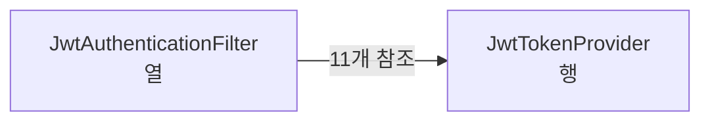
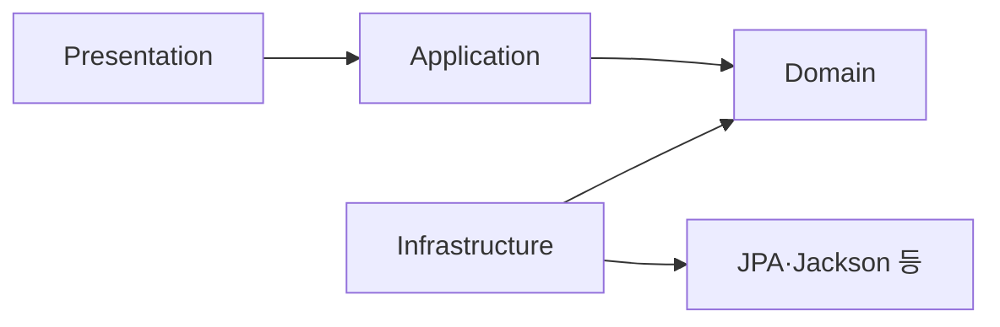
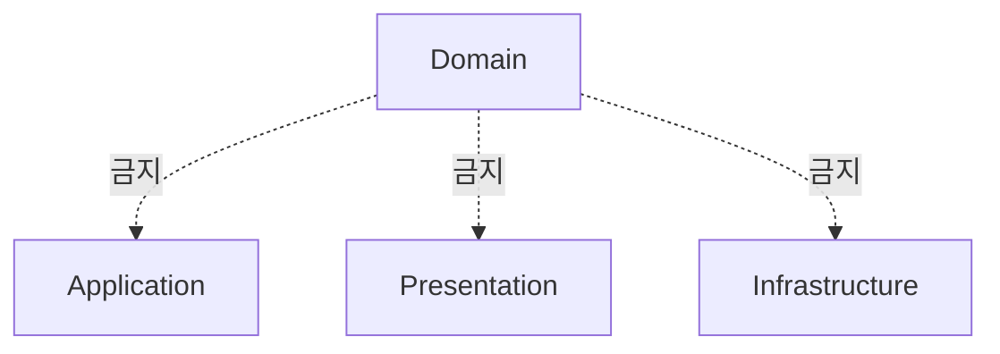
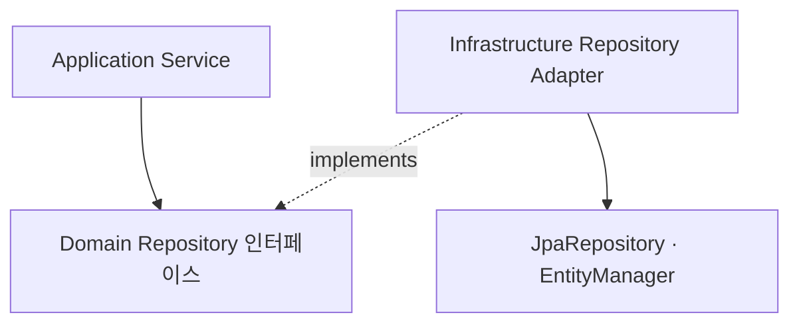
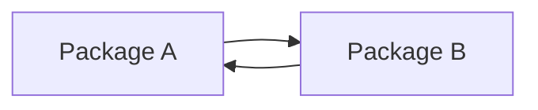
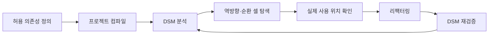

패키지를 계층별로 나눴다고 해서 의존성 방향까지 자동으로 지켜지는 것은 아닙니다. Application이 Infrastructure 구현체를 직접 참조하거나 Domain이 Spring·JPA에 의존하면 폴더 구조는 그럴듯해도 실제 아키텍처는 무너집니다.

IntelliJ IDEA의 **DSM(Dependency Structure Matrix)**을 사용하면 모듈·패키지·클래스 사이의 의존 관계를 정사각형 행렬로 확인할 수 있습니다. 이번 글에서는 DSM을 읽는 방법과 DDD·DIP 관점에서 계층 의존성을 검사하는 기준을 정리합니다.

## DSM이란?

DSM은 Dependency Structure Matrix의 약자입니다. 분석 범위 안의 구성 요소를 행과 열에 같은 순서로 배치하고, 교차 셀에 참조 관계를 표시합니다.


DSM으로 다음 문제를 확인할 수 있습니다.

- 계층 간 역방향 의존성
- 패키지나 클래스 사이의 순환 의존성
- 특정 클래스 변경 시 영향을 받는 범위
- 설계한 Port·Adapter 방향이 코드에서도 지켜지는지 여부
- 리팩터링 전후 의존성 변화

IntelliJ 공식 문서에 따르면 DSM은 의존 관계와 정보 흐름을 시각화하고, 변경이 프로젝트에 어떻게 전파되는지 확인하는 도구입니다.

> Dependency Structure Matrix 플러그인은 IntelliJ IDEA Ultimate 구독이 필요합니다.

## 플러그인 설치하기

1. IntelliJ IDEA에서 `Settings/Preferences → Plugins`를 엽니다.
2. `Marketplace`에서 `Dependency Structure Matrix`를 검색합니다.
3. `Install`을 선택합니다.
4. 안내가 나타나면 IntelliJ IDEA를 재시작합니다.

설정 단축키는 다음과 같습니다.

| 환경 | 단축키 |
| --- | --- |
| macOS | `⌘ ,` |
| Windows·Linux | `Ctrl + Alt + S` |

## 의존성 매트릭스 실행하기

분석 전 프로젝트를 먼저 컴파일합니다. 오래된 class 파일을 기준으로 분석하면 의존 관계가 누락되거나 잘못 표시될 수 있습니다.

실행 방법은 두 가지입니다.

### Project 창에서 실행

1. 분석할 모듈 또는 패키지를 우클릭합니다.
2. `Analyze → Analyze Dependency Matrix`를 선택합니다.
3. 분석 범위를 확인하고 `Analyze`를 누릅니다.

### 전체 메뉴에서 실행

`Code → Analyze Code → Dependency Matrix`를 선택합니다.

분석이 끝나면 DSM 도구 창이 열립니다. 모듈에서 패키지, 클래스 수준으로 펼치며 의존성을 확인할 수 있습니다.

## DSM의 행과 열 읽기

DSM에서 가장 헷갈리는 부분은 의존성 방향입니다.

> **열의 클래스가 행의 클래스를 참조합니다.**

다음 문장으로 기억하면 쉽습니다.

```text
열 → 행
```

예를 들어 교차 셀이 다음과 같다고 가정하겠습니다.

```text
JwtAuthenticationFilter 열
× JwtTokenProvider 행
= 11
```

이는 `JwtAuthenticationFilter`가 `JwtTokenProvider`를 11개의 참조 지점에서 사용한다는 의미입니다.



셀의 표시는 다음처럼 해석합니다.

| 표시 | 의미 |
| --- | --- |
| 숫자 | 두 구성 요소 사이의 참조 항목 수 |
| 빈칸 | 직접 의존성이 없음 |
| 대각선의 `-` | 자기 자신에 해당하는 셀 |
| 색상 농도 | 의존성 개수의 상대적 크기 |
| 빨간색 관계 | 상호 의존 또는 순환 의존 가능성 |

셀을 선택하면 실제 필드·생성자·메서드 참조를 확인할 수 있습니다. 우클릭 후 `Find Usages for Dependencies`를 사용하면 의존성이 발생한 코드 위치까지 추적할 수 있습니다.

## DDD 계층에서 허용할 의존성

이 글에서 확인할 계층 방향은 다음과 같습니다.



간단히 표현하면 다음 구조입니다.

```text
Presentation → Application → Domain
Infrastructure ───────────→ Domain
```

각 계층의 역할은 다음과 같습니다.

| 계층 | 역할 |
| --- | --- |
| Presentation | HTTP 요청을 받고 Application을 호출 |
| Application | 유스케이스를 조합하고 Domain을 사용 |
| Domain | 핵심 비즈니스 규칙과 Port 계약 보유 |
| Infrastructure | DB·외부 API·메시징 등 기술 구현 제공 |

정상적으로 나타날 수 있는 관계는 다음과 같습니다.

- `Presentation → Application`
- `Application → Domain`
- `Infrastructure → Domain`
- `Infrastructure → JPA`, `Jackson` 등 기술 구현

## 비어 있어야 하는 역방향 의존성

다음 관계에 숫자가 나타나면 계층 규칙을 다시 확인해야 합니다.

```text
Application → Infrastructure
Application → Presentation
Domain → Application
Domain → Infrastructure
Domain → Presentation
```

특히 Domain은 외부 계층을 몰라야 합니다.



Domain 열과 Application·Presentation·Infrastructure 행의 교차 셀이 비어 있다면 Domain이 외부 계층을 직접 참조하지 않는다는 뜻입니다.

## DSM 표로 계층 방향 확인하기

DSM은 **열이 행을 의존**한다는 기준으로 읽어야 합니다. 다음은 정상적인 예시입니다.

| 행 ↓ / 열 → | Infrastructure | Presentation | Application | Domain |
| --- | ---: | ---: | ---: | ---: |
| Infrastructure | `-` | 빈칸 | 빈칸 | 빈칸 |
| Presentation | 빈칸 | `-` | 빈칸 | 빈칸 |
| Application | 빈칸 | `11` | `-` | 빈칸 |
| Domain | `11` | 빈칸 | `58` | `-` |

각 숫자는 다음과 같이 읽습니다.

### Presentation 열 × Application 행

`Presentation`이 `Application`을 참조합니다. 요청을 받은 Controller가 UseCase를 호출하는 방향이므로 정상입니다.

### Application 열 × Domain 행

`Application`이 `Domain`을 참조합니다. Application Service가 Aggregate나 Repository Port를 사용하는 방향이므로 정상입니다.

### Infrastructure 열 × Domain 행

`Infrastructure`가 Domain의 Repository 인터페이스나 Entity를 참조합니다. Adapter가 Port를 구현하는 방향이므로 정상입니다.

### Application 열 × Infrastructure 행

이 셀은 비어 있어야 합니다. 숫자가 있다면 Application이 JPA Adapter 같은 구현체를 직접 참조하고 있을 가능성이 있습니다.

## Repository로 DIP 확인하기

DDD와 헥사고날 구조에서는 Repository 인터페이스와 구현체의 위치가 중요합니다.



Application Service는 Repository 인터페이스만 알고, Infrastructure Adapter가 이를 구현합니다. 따라서 코드 의존성은 다음 방향을 가집니다.

```text
Application → Domain Repository Port
Infrastructure → Domain Repository Port
Infrastructure → JPA
```

다음 구조가 발견되면 DIP가 깨진 것입니다.

```java
// Application 계층이 Infrastructure 구현체를 직접 참조하는 잘못된 예
public class MemberService {
    private final MemberJpaRepositoryAdapter repository;
}
```

Application은 구현체가 아닌 Port를 참조해야 합니다.

```java
public class MemberService {
    private final MemberRepository repository;
}
```

DSM에서 `Application 열 × Infrastructure 행`이 비어 있는지 확인하면 이 규칙을 코드 수준에서 검증할 수 있습니다.

## 순환 의존성 찾기

두 패키지나 클래스가 서로 참조하면 변경 영향이 양방향으로 전파됩니다.



DSM에서는 대칭 위치의 두 셀에 모두 의존성이 나타나며, 상호 의존 관계는 빨간색으로 표시됩니다. 순환이 발견되면 다음을 확인합니다.

- 공통 책임을 별도 모듈로 잘못 추출한 것은 아닌지
- 두 패키지의 책임 경계가 실제로 하나인지
- 인터페이스를 의존하는 쪽으로 이동해 방향을 역전할 수 있는지
- 이벤트나 Port로 직접 호출을 분리할 수 있는지

순환을 무조건 인터페이스 하나로 숨기기보다 책임과 변경 이유를 먼저 확인해야 합니다.

## 실제 위반 위치 추적하기

의심되는 셀을 찾았다면 숫자만 보고 끝내지 않고 실제 코드를 확인합니다.

1. 위반 가능성이 있는 교차 셀을 선택합니다.
2. 상세 목록에서 참조한 클래스와 참조된 클래스를 확인합니다.
3. 우클릭 후 `Find Usages for Dependencies`를 실행합니다.
4. 필드 타입, 생성자 인자, 메서드 호출, 상속 관계를 확인합니다.
5. Port 이동, 의존성 역전, 책임 분리 중 적절한 방법으로 수정합니다.
6. 프로젝트를 다시 컴파일하고 DSM을 재실행합니다.
7. 기존 역방향 셀이 비었는지 확인합니다.

분석 범위가 너무 넓다면 필요한 행을 선택한 뒤 `Limit Scope To Selection`을 사용해 새 매트릭스로 좁힐 수 있습니다.

## 실무에서 활용하는 순서

DSM은 한 번 보고 끝내는 그림보다 리팩터링 전후를 비교하는 검사 도구로 사용할 때 유용합니다.



권장 확인 순서는 다음과 같습니다.

1. 먼저 계층별 허용 방향을 문서로 정의합니다.
2. 패키지 수준에서 전체 구조를 확인합니다.
3. 이상이 있는 패키지만 클래스 수준으로 펼칩니다.
4. 셀을 통해 실제 사용 위치를 찾습니다.
5. 리팩터링 후 같은 범위의 DSM을 다시 확인합니다.

의존성 개수가 많다는 사실만으로 문제라고 판단하면 안 됩니다. 핵심은 **개수보다 방향과 순환 여부**입니다.

## 정리

DSM을 읽을 때 가장 먼저 기억해야 할 규칙은 하나입니다.

> **열의 클래스가 행의 클래스를 의존한다.**

DDD·DIP 구조에서는 `Presentation → Application → Domain`, `Infrastructure → Domain` 방향은 허용하고, Domain에서 외부 계층으로 향하는 의존성과 Application에서 Infrastructure로 향하는 의존성은 비어 있어야 합니다.

폴더 구조만 보고 아키텍처가 지켜졌다고 판단하기보다 DSM으로 실제 참조 관계를 확인하면 역방향 의존성과 순환을 코드 수준에서 빠르게 발견할 수 있습니다.

## 참고 자료

- [JetBrains: Dependency Structure Matrix](https://www.jetbrains.com/help/idea/dsm-analysis.html)
- [JetBrains: Install plugins](https://www.jetbrains.com/help/idea/managing-plugins.html)
